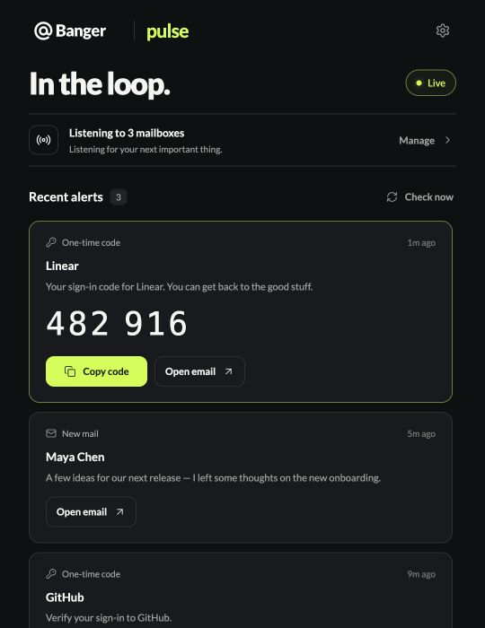
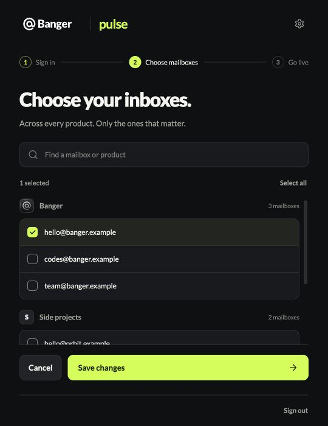
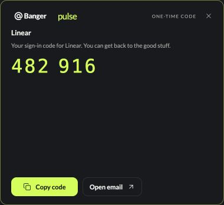
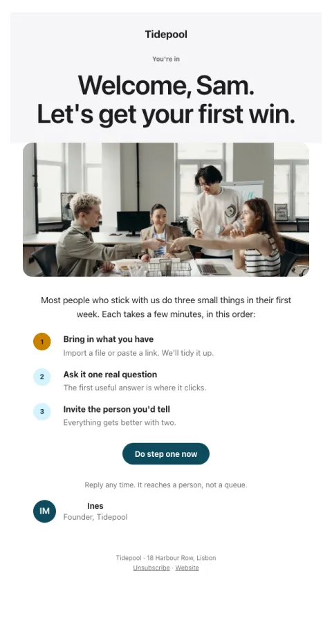
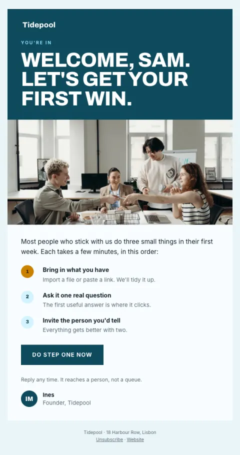

# Bangerverse

**Little superpowers for your email automation.** An open source home for apps and integrations built around [Banger](https://bangermail.com).

## Meet Pulse

[**Banger Pulse**](apps/pulse) is a lightweight desktop companion for macOS, Windows, and Linux. Pick the mailboxes that matter, then let Pulse watch for new mail and one time codes while you work.

<p align="center">
  
</p>

- **Your inboxes, your choice.** Select mailboxes across your Banger products.
- **Useful alerts.** Get desktop notifications for new mail, with a browser link to the exact thread.
- **Codes within reach.** Copy a detected code from an alert, or find the latest code in the tray.
- **Small footprint.** Pulse stays in the tray, keeps only a short recent-alert list in memory, and does not save email bodies.

| Choose what to watch | Copy and get back to work |
| :---: | :---: |
|  |  |

*Screenshots use sample mailboxes and messages.*

Pulse signs in through Banger OAuth, listens for realtime mail events, and fetches message details only when needed to make an alert. Read the [Pulse guide](apps/pulse/README.md) for setup, platform behavior, and the current Banger integration requirements.

### Run it locally

Install [Rust](https://rustup.rs/) and the [Tauri 2 prerequisites](https://v2.tauri.app/start/prerequisites/), then:

```sh
cd apps/pulse
npm install
npm run dev
```

## Email templates

[**70 email templates**](templates) that look designed and do a job: welcomes, trial endings, abandoned carts, receipts, newsletters, event invites and more, for SaaS, shops, creators, services, local businesses and communities. Each comes with a brief (what it's for, when to send it, what to measure, why it works) and renders in eight styles, in your brand's colors and fonts. Plain email-safe HTML you can use anywhere.

<p align="center">
  
  
  
  
</p>

## What's next

| Project | Status | Idea |
| --- | --- | --- |
| [Pulse](apps/pulse) | In development | Desktop mail alerts and one time codes. |
| [Templates](templates) | Available | 70 email templates in eight styles, with briefs. |
| **MailG** | Planned | Another way to work with mail in the Bangerverse. We'll publish the scope as it takes shape. |
| **More companions** | Open for ideas | Small, focused tools that connect through Banger's OAuth, API, and realtime interfaces. |

## Make it yours

We built this to be forked. Make Pulse your own, invent a new workflow, or build something we haven't imagined yet. We can't wait to see what you make.

Made something even cooler? Email [hello@team.bangermail.com](mailto:hello@team.bangermail.com) with a link and a screenshot or short demo. We'd love to share community projects on Twitter and elsewhere.

## For builders

The [integration contract](docs/integration-contract.md) documents the Banger interfaces these projects use. This repository contains no Banger server or web app source. Keep credentials, real mail, and generated builds out of commits.

Code here is [MIT licensed](LICENSE) unless a project says otherwise. Banger names and logos remain their owners' trademarks; the code license does not grant trademark rights.
