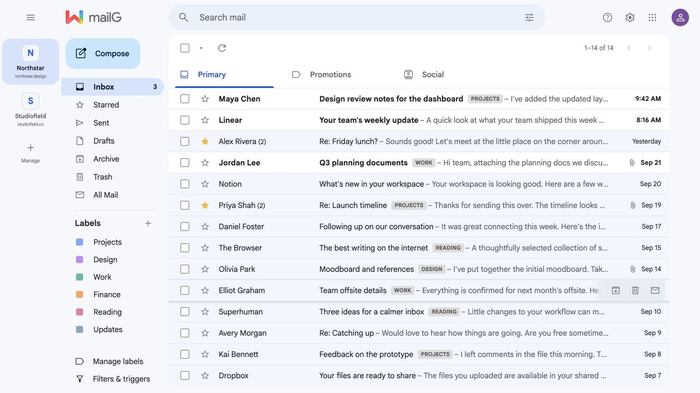
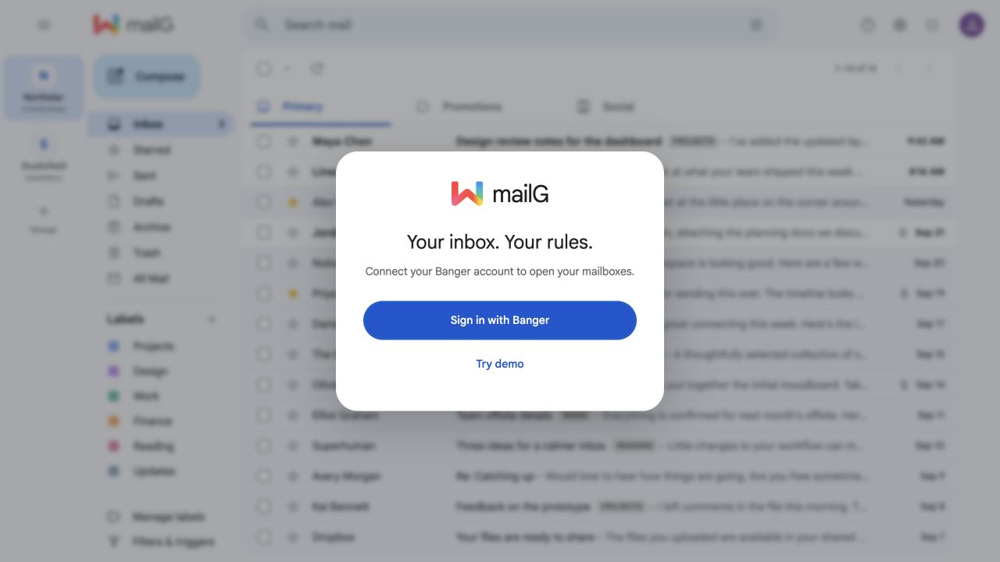
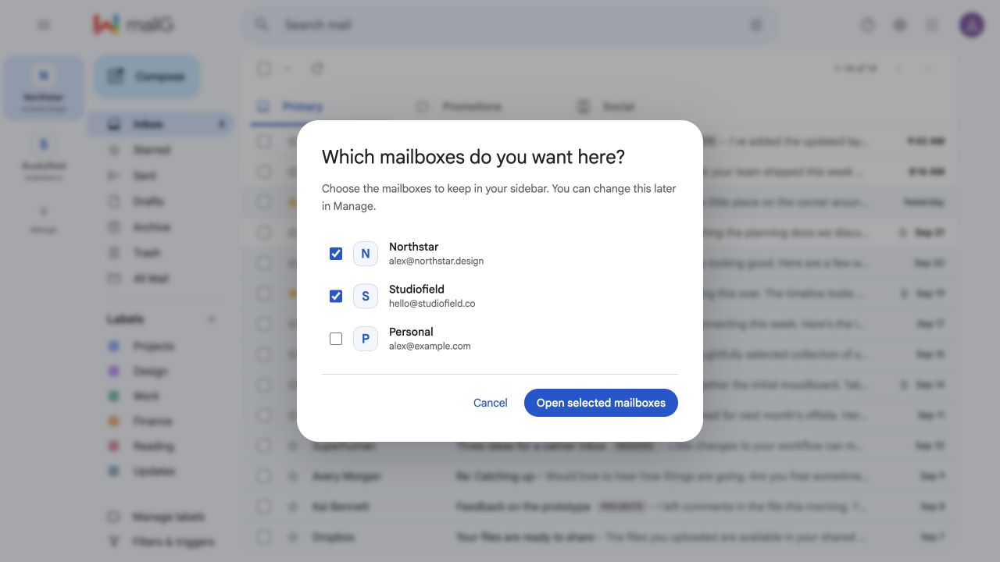
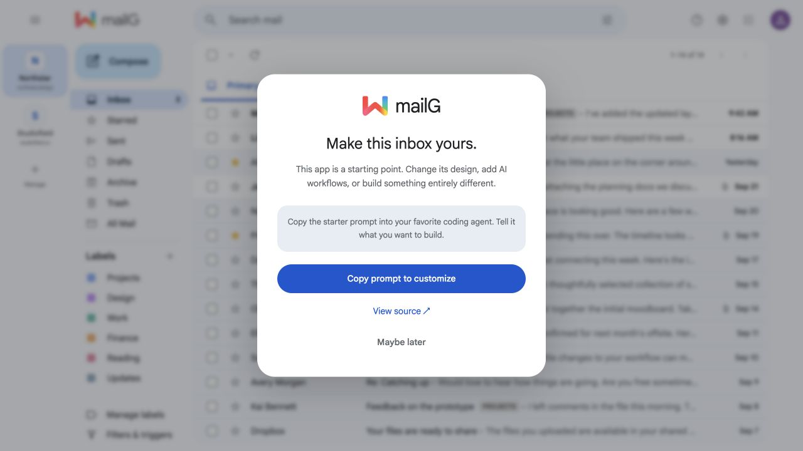

# mailG

mailG is an open-source, Gmail-style web interface for mailboxes hosted by Banger. Its desktop layout follows [Google's Gmail Material 3 reference](https://blog.google/products-and-platforms/products/gmail/gmail-design-update/); the left app rail is intentionally a quick switcher for the mailboxes chosen during setup. Banger remains the source of truth for messages, drafts, labels, sends, and triage. A fork does **not** need a Google OAuth app: mailG registers its own public PKCE client with Banger when a user signs in.

<p align="center">
  
</p>

**Your inbox. Your rules.** Start with a working email interface, then make it your own with your favorite coding agent.

- **Choose your mailboxes.** Keep the inboxes you care about in the left rail, with product avatars and domain labels.
- **Work with your mail.** Read threads, compose drafts, manage labels, and archive, star, or mark messages read and unread.
- **Make it yours.** Copy a starter prompt from the app to change the design, add a workflow, or build a different kind of email client.
- **Explore before connecting.** Try the sample inbox without signing in; connect Banger when you want to use your own mail.

| Start with a demo or your own mail | Choose what belongs in your sidebar |
| :---: | :---: |
|  |  |

*All screenshots use fictional demo mailboxes and messages.*

## How it works

1. **Sign in with Banger—or try the demo.** The welcome dialog sits over a blurred sample inbox. Try demo opens it immediately. Sign-in uses Banger OAuth with PKCE; tokens remain on the server.
2. **Choose your mailboxes.** On your first connected visit, select the mailboxes to show in the sidebar. mailG remembers the selection for this workspace in this browser. Use **Manage** to change it later.
3. **Open your inbox.** Demo/view state is cleared as mailG switches to live mail. The scrim stays in place until the selected inbox loads. This clears interface state, not mail stored in Banger.
4. **Make it yours.** A one-time invitation appears after the inbox is visible. **Copy prompt to customize** gives your coding agent the source location, setup steps, and a place to describe your idea. The header's **Customize mailG** button reopens it.

<p align="center">
  
</p>

## Build your own version

Use the in-app starter prompt or give your coding agent this brief:

> Read `apps/mailg/AGENTS.md` and `apps/mailg/README.md`, run the app in demo mode, and help me customize it. Start by asking what I want to build. Preserve Banger OAuth, mailbox isolation, and the email HTML sandbox. Keep credentials on the server and verify changes with fictional mail.

Ideas to start with: a calmer reading view, a keyboard-first inbox, a support queue, or an AI-assisted workflow. The existing app provides the mail interface and Banger integration; additional AI features need their own implementation and provider configuration.

## Run the local preview

```sh
cp .env.example .env.local
npm ci
npm run dev
```

Open `http://127.0.0.1:3000`. The example enables deterministic demo mode, so you can inspect the layout without a Banger account.

## Connect to Banger

Set `MAILG_DEMO_MODE=false`, `APP_URL` (the exact public origin, or localhost during development), and `SESSION_ENCRYPTION_KEY` (base64 encoding of 32 random bytes). Generate the key with `openssl rand -base64 32`. `BANGER_API_URL` defaults to `https://api.bangermail.com` and can be overridden for another Banger deployment.

The browser is redirected to Banger for consent. mailG registers `APP_URL/api/auth/callback` automatically, requests `mail:read mail:write mail:send`, and holds rotating tokens only on the server. Access depends on the user's Banger workspace role and scopes. Banger accepts loopback HTTP callback URLs for local development; public origins require HTTPS. There is no Google API or Gmail account connection in this app.

Production sessions require a durable store. On Vercel, provide `UPSTASH_REDIS_REST_URL` and `UPSTASH_REDIS_REST_TOKEN` (or `KV_REST_API_URL` and `KV_REST_API_TOKEN`) from a Redis integration. For a **single-instance** Docker deployment, set `MAILG_SESSION_STORE=file` and mount `/app/work/session-store` on durable storage. Never use the file store across multiple instances. Redis records are encrypted with `SESSION_ENCRYPTION_KEY`; keep the key stable across deploys.

## Deploy

### Vercel

Import this repository as a Next.js project. Set:

| Variable | Value |
| --- | --- |
| `MAILG_DEMO_MODE` | `false` |
| `SESSION_ENCRYPTION_KEY` | Base64 encoded 32 random bytes |
| `UPSTASH_REDIS_REST_URL`, `UPSTASH_REDIS_REST_TOKEN` | Durable Redis REST credentials |
| `APP_URL` | Optional if `VERCEL_URL` is available; set for a stable custom domain |
| `BANGER_API_URL` | Optional; defaults to Banger production API |

The Vercel configuration is in `vercel.json`. A literal one-click deployment cannot be promised until a public template repository and durable Redis integration are configured. Each deployment can self-register its Banger OAuth callback when the first user signs in. The full callback URL must remain stable; changing the deployment domain starts a new client registration.

### Docker

Copy `.env.example` to `.env`, set `MAILG_DEMO_MODE=false`, `APP_URL` to the externally reachable HTTPS origin, and `SESSION_ENCRYPTION_KEY`. Run `docker compose up --build -d`. Put HTTPS termination in front of port 3000. The Compose volume persists sessions; run one instance with the file store.

## Supported Banger features

- First-run mailbox selection, quick switching in the left rail, inbox and folder views, cursor paging, search, thread details, attachment download, and isolated message HTML. Demo mode includes Gmail-like Primary, Promotions, and Social tabs; the live app omits those tabs because Banger has no category view.
- Read/unread, star, archive, trash, and label commands. Bulk actions send one idempotent command per thread. The UI polls command status and restores the prior list if Banger reports failure.
- Draft create/update and autosave, recipient fields, raw attachment upload (25 MiB Banger limit), attachment removal, and idempotent draft send with status polling.
- Manual mailbox-scoped labels; paid Banger triage rules with exact or natural-language conditions and match preview. The Banger API's `402 plan_upgrade_required` response is the entitlement authority.
- Signed realtime tickets; notifications contain metadata only and cause targeted refetches, with reconnect reconciliation.

The current UI does not expose triage action history, undo, past-mail runs, reply-all, or Gmail's keyboard shortcuts. It does not expose webhook automation or other trigger actions that the Banger mail triage API does not support.

## Architecture and security

The Next.js server stores an opaque ID in an HttpOnly, SameSite cookie and stores AES-GCM encrypted OAuth tokens in the durable store. Access token refresh is serialized with a store lock because Banger rotates refresh tokens. The server proxies only an allowlist of Banger mail routes and derives the workspace path from the access token, never from a client supplied workspace ID. Mutations require the configured same origin. Message HTML is served with a restrictive CSP and should be shown in a sandboxed iframe.

Brand, theme, and feature defaults live in `src/config.ts`. The typed browser adapter is `src/lib/client.ts`; Banger proxy and session code are in `src/app/api` and `src/lib/server`.

## Verification status

The deterministic demo, welcome and mailbox dialogs, customization prompt copying, local interactions, typecheck, and production build were verified. A live Banger OAuth/send/attachment flow requires a reachable Banger deployment, eligible account, and a configured durable store; it has not been verified here. See `design-qa.md` for the visual comparison and remaining differences.

## License

MIT for mailG code. See `NOTICE.md` for separately licensed bundled assets and source attribution. Gmail is a trademark of Google LLC; mailG is independent of Google.

### Signed-in user profile limitation

The account menu represents the Banger sign-in, independently of the selected mailbox. It currently uses a neutral avatar: Banger's published OAuth metadata exposes no user-info endpoint or profile scopes, and OAuth access tokens omit email/name/avatar. Banger's first-party `/auth/me` endpoint requires its own session and does not accept the OAuth token used by this sample.

To display the actual account email and avatar, Banger must expose an authorized OAuth profile endpoint (email, display name, avatar URL or authenticated avatar resource). Retrieve that profile server-side using the existing OAuth session and return only its display fields through `/api/session`. Do not substitute mailbox addresses, product logos, or synthetic OAuth actor emails for the signed-in user's identity.
