# Banger email templates

**70 email templates that look designed and do a job.** Each one is built for a moment in a customer's life (a welcome, a trial ending, an abandoned cart, a receipt) and comes with a brief: what it's for, when to send it, what to measure, and why it works.

They are plain, email-safe HTML: tables, inline styles, colour behind every image, columns that stack on phones. They render in any brand from four colours and two fonts, and every image slot starts with **brand art** generated from those colours, so a template looks finished even for a brand with no photos.

These are the same starters [Banger](https://bangermail.com) uses. In Banger they render in your brand automatically and an agent can fill them in for you. Here they're yours to fork.

## Use them

Every template folder has:

- `template.html`: the source, with `{{brand.*}}` tokens for colours and fonts and `{{slot}}` tokens for copy.
- `template.json`: the name, subject, brief, slots and default copy.
- `preview.html`: the template rendered in a sample brand, ready to open in a browser.

To render all of them in your own brand:

```sh
cd templates
node render.mjs brand.example.json out/            # your brand style
node render.mjs brand.example.json out/ editorial  # or any preset
```

`brand.example.json` shows the fields (`email_style` sets the default style). Image slots start on free Pexels photos (Pexels license: free for commercial use, no attribution required) or brand art served by Banger (`https://api.bangermail.com/v1/art/...`); swap in your own image URLs whenever you like. `{{first_name|there}}`-style tokens are recipient fields with a fallback; replace them with your email platform's merge tags.

## Styles

Every template renders in eight styles. **Your brand** (the default) takes the preset closest to your look and wears your own fonts and colors; the seven presets use their own designed type in your colors.

| Style | Look |
| --- | --- |
| **Your brand** | Your fonts and colors, shaped like the closest preset. |
| **Material** | Tonal surfaces, rounded cards, pill buttons. |
| **Clarity** | White space, centered, big tight headlines, product first. |
| **Editorial** | A magazine: masthead, light serif, square photos. |
| **Bold** | Poster energy: heavy uppercase type, color blocks, square edges. |
| **Luxe** | Centered, airy, tracked capitals, outline buttons. |
| **Playful** | Big radii, tinted canvas, friendly and centered. |
| **Plain** | Almost text: system fonts, no decoration, reads like a person wrote it. |

The welcome email in each style:

<p> 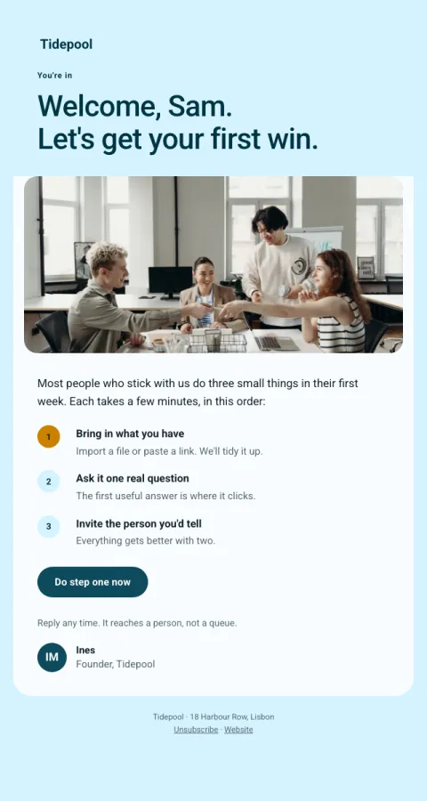    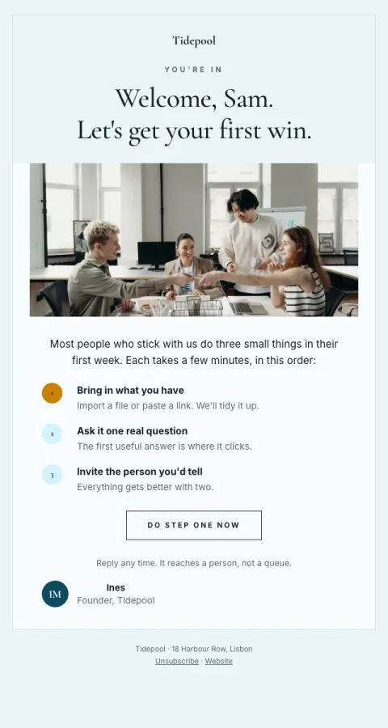 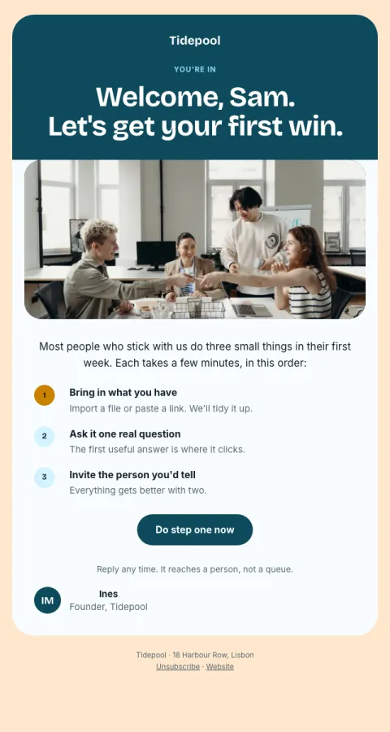 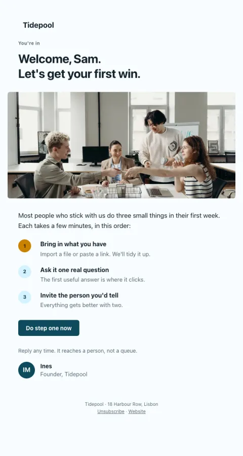</p>

Colors come from tonal palettes built from your brand color (Material-style tones), so contrast holds for any brand. With no accent color the emails stay monochrome.

## The rules they follow

- **One job, one button.** Every template has one primary action and one metric.
- **A named mechanic.** Progress already made, the reader's own numbers, one-click answers, a double-sided reward, a question that invites a reply. The brief says which, so a rewrite keeps it.
- **Calm beats urgent.** Real deadlines only. Dunning and limits lead with "nothing's changed yet".
- **Readable with images off.** Headlines are live text, and every image has alt text and a colour behind it.
- **Phone first.** Columns stack, buttons are thumb-sized, and templates stay far below Gmail's 102 KB clipping limit.

## Gallery

### Welcome

| | Template | For | Why it works |
| :---: | --- | --- | --- |
|  | **[Welcome · first three moves](welcome/)**<br>A bold brand hero and an ordered three-step path, with the button on step one only. | Software & apps, Community & nonprofit | An ordered path with one button on the first move. A specific next step beats 'explore the product'. |
|  | **[Welcome · shop](welcome-shop/)**<br>A welcome gift code, the story in one line, and bestsellers with photos. | Online shop, Local business | The promised welcome offer up front, then social proof by showing bestsellers ('what people love'). |
|  | **[Welcome · newsletter](welcome-creator/)**<br>What to expect, three best-of posts to start with, and a question to reply to. | Creator & newsletter, Community & nonprofit | Sets expectations (cadence), hands over the best work so the first impression is the best, then asks a question to get a reply (which also trains inbox placement). |
|  | **[Welcome · client](welcome-services/)**<br>What happens next as a dated timeline, and the person they'll work with. | Services & agency, Local business | A clear timeline removes uncertainty; a real person's face and name makes it a relationship, not a vendor. |
|  | **[Personal note](plain/)**<br>A plain, signed note from a real person with one easy question to reply to. | Software & apps, Online shop, Creator & newsletter, Services & agency, Local business, Community & nonprofit | Looks like a personal email, so it gets read like one. Replies improve inbox placement and tell you what to build. |
| 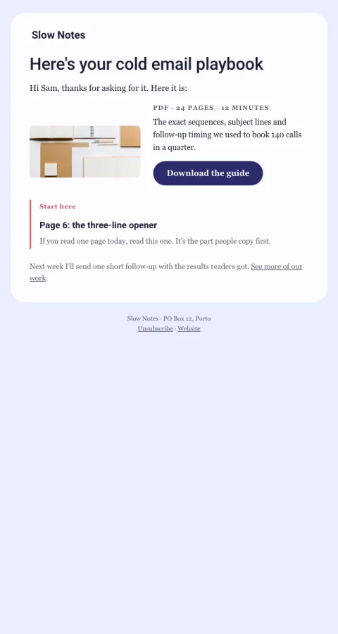 | **[Your download](lead-magnet/)**<br>Delivers the promised guide instantly, then one soft next step. | Creator & newsletter, Services & agency, Software & apps | Keeps the promise in the first second; the cover image makes it tangible; the tip gives a reason to open the file today. |

### Get started

| | Template | For | Why it works |
| :---: | --- | --- | --- |
|  | **[Setup progress](first-week-tips/)**<br>Endowed progress: finished steps first, then one highlighted next step with its time cost. | Software & apps | Endowed progress: showing what's already done makes finishing feel close. The next step names its time cost. |
|  | **[Stuck? Can I help](stuck-help/)**<br>A behavior-triggered personal offer of 15 minutes, with no feature list. | Software & apps, Services & agency | Human help at the moment of friction converts better than another tips email. |
|  | **[Feature spotlight](feature-spotlight/)**<br>One feature they haven't used, one screenshot, one deep link straight into it. | Software & apps | One feature per email, shown not described, with a deep link that drops them right into it. |
|  | **[First win](first-win/)**<br>Celebrates the activation moment and points to the next habit while the feeling is fresh. | Software & apps, Creator & newsletter | Peak moment: celebrate the win, then attach the next habit while motivation is highest. |
|  | **[Better with two](better-together/)**<br>Shows sharing with their own work's name, and a pre-filled invite. | Software & apps, Community & nonprofit | Uses their own project's name (ownership) and makes the invite one click. |

### Convert

| | Template | For | Why it works |
| :---: | --- | --- | --- |
| 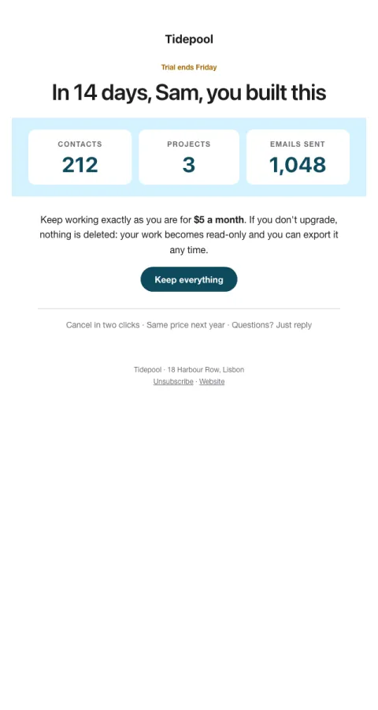 | **[Trial ending · what you built](trial-ending/)**<br>Their own numbers, one price, and the reassurance that nothing is deleted. | Software & apps | Loss aversion with their own numbers, plus 'nothing is deleted'. Showing what they built works; threats don't. |
|  | **[Your work is safe](trial-expired/)**<br>After the trial: a grace period, one-click reactivation, and a real person to ask. | Software & apps | Relief ('still here') beats pressure; one click brings everything back exactly as it was. |
|  | **[Switch to annual](annual-switch/)**<br>Their real yearly spend next to the annual price, with the saving as the big number. | Software & apps, Creator & newsletter, Services & agency | Shows the saving as one big concrete number computed from their own bill. |
| 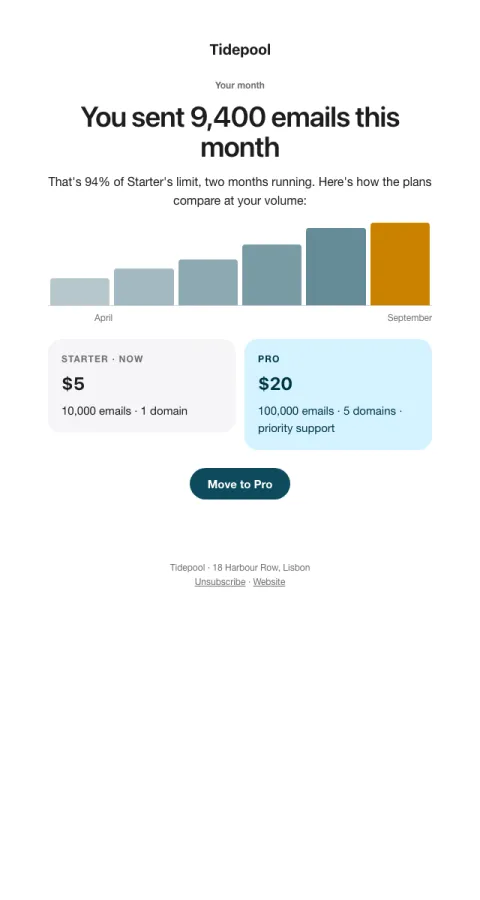 | **[You've outgrown your plan](upgrade-fit/)**<br>Usage evidence first, then the two plans side by side. | Software & apps | Evidence first ('you did X'), then a fair comparison. People upgrade when it's their own conclusion. |
| 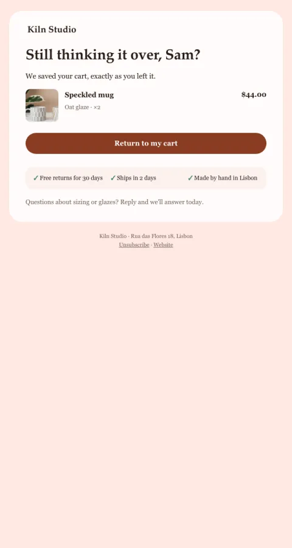 | **[Left in your cart](cart-recovery/)**<br>The product with its photo, three reassurances, and no discount on the first touch. | Online shop | Remind with the photo, then remove the usual doubts (shipping, returns, security). Discounts on the first touch train people to abandon. |
|  | **[Back in stock](back-in-stock/)**<br>The product they waited for, the real quantity left, and one button. | Online shop | Real scarcity (an honest batch size) and 'you asked us to tell you first'. |
|  | **[Give one, get one](referral/)**<br>A double-sided reward, their personal link, and progress toward the reward. | Software & apps, Online shop, Creator & newsletter | Double-sided rewards feel generous rather than salesy; a personal link and progress make it concrete. |

### Keep

| | Template | For | Why it works |
| :---: | --- | --- | --- |
| 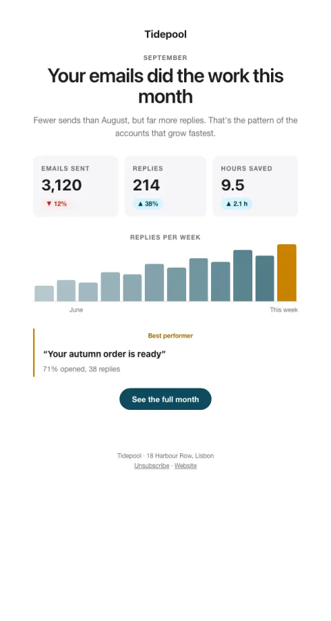 | **[Monthly report](product-digest/)**<br>Their own numbers with change on last month, a small chart, and one highlight. | Software & apps, Creator & newsletter, Services & agency | Personal numbers with a trend give credit to the person; a highlight makes it a story, not a spreadsheet. |
|  | **[Year in review](anniversary/)**<br>Full-bleed color blocks with big identity stats people want to share. | Software & apps, Online shop, Creator & newsletter, Community & nonprofit, Local business | Identity stats ('top 3%') people want to share because they say something good about them. |
| 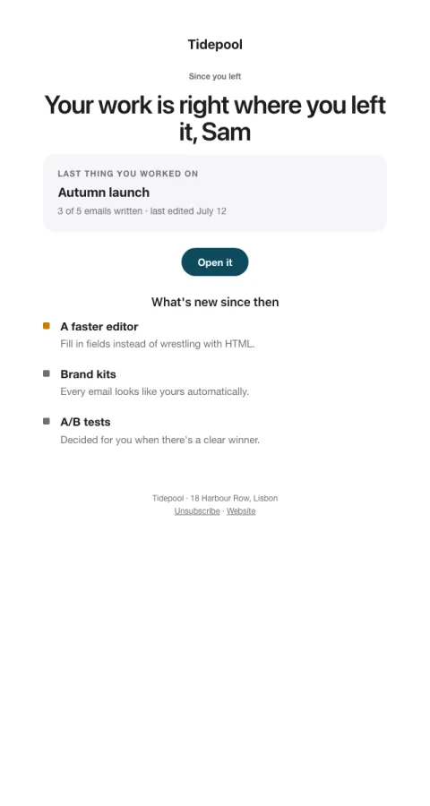 | **[We saved your spot](win-back/)**<br>Opens on the last thing they worked on, then what's new, with one click back into it. | Software & apps, Creator & newsletter, Community & nonprofit | Their own unfinished work (Zeigarnik effect) is a stronger pull than any feature news. |
|  | **[We miss you · shop](win-back-shop/)**<br>A warm note, a thank-you offer, and new pieces since their last order. | Online shop, Local business | Novelty (what's new since they last came) plus a thank-you, not a desperate discount. |
|  | **[NPS · answer in the email](nps/)**<br>Tapping a number is the answer. No survey to open. | Software & apps, Services & agency, Online shop, Community & nonprofit | The survey is inside the email; one tap records the answer. Several times the responses of 'click to open a survey'. |
| 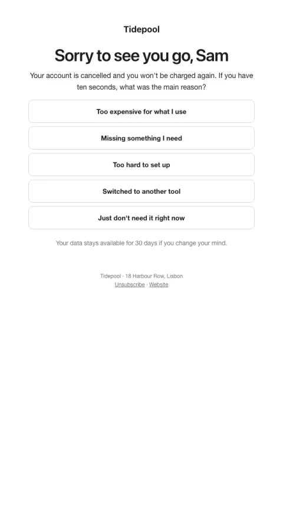 | **[Why did you leave?](churn-survey/)**<br>Five one-click reasons; each can branch the journey to a matching reply. | Software & apps, Creator & newsletter, Community & nonprofit | One-click reasons get answered; each link can trigger a tailored follow-up (a discount for price, a roadmap note for features). |
| 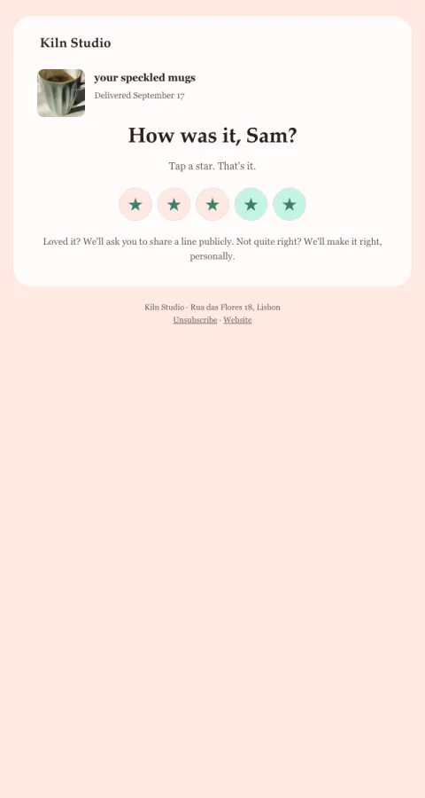 | **[Rate us in one tap](review-request/)**<br>Stars in the email: happy customers go to a public review, unhappy ones to you. | Online shop, Services & agency, Local business, Software & apps | Stars as links: 4–5 route to your public review page, 1–3 to a private feedback form so you can fix it. |
|  | **[Still want these?](reconfirm/)**<br>Asks quiet readers to reconfirm before you stop sending, which protects deliverability. | Software & apps, Online shop, Creator & newsletter, Services & agency, Local business, Community & nonprofit | Honest re-permission. Removing silent contacts improves inbox placement for everyone who stays. |
|  | **[Birthday treat](birthday/)**<br>A warm birthday note with a gift that feels like a gift. | Local business, Online shop | Reciprocity: a real gift with no strings creates goodwill that shows up as visits. |

### Announce & publish

| | Template | For | Why it works |
| :---: | --- | --- | --- |
|  | **[Announcement](announcement/)**<br>Your own hero image (or brand art), one headline, one reason to care, one button. | Software & apps, Online shop, Creator & newsletter, Services & agency, Local business, Community & nonprofit | Image, headline, one paragraph, one button: nothing competes with the news. |
|  | **[Product launch](launch-spotlight/)**<br>Keynote framing on dark: a name, a sentence, a product shot, three concrete benefits. | Software & apps | One name, one sentence, one picture, three benefits. Dark stands out in a light inbox. |
|  | **[What shipped](changelog/)**<br>New, improved and fixed, tagged, with one screenshot for the headline change. | Software & apps | Scannable tags let people find what they care about; one screenshot sells the headline change. |
|  | **[You asked, we built](you-asked/)**<br>Quotes a customer's own request, then shows what shipped. | Software & apps, Community & nonprofit | Seeing their own words proves you listen; that goodwill turns into usage and referrals. |
|  | **[Newsletter · editorial](newsletter/)**<br>A magazine masthead, one lead story with an image, two secondary stories and a short link list. | Creator & newsletter, Software & apps, Community & nonprofit, Services & agency | Magazine hierarchy: one lead story earns the open, secondary stories and links reward scanning. |
|  | **[Five things this week](link-roundup/)**<br>A numbered list of five links, one line each, with where they're from. | Creator & newsletter, Community & nonprofit, Software & apps | A fixed, countable format people learn to trust; one line each respects their time. |
|  | **[Founder letter](essay/)**<br>A long-form letter in a reading column with one pull quote and one link at the end. | Creator & newsletter, Software & apps, Services & agency | Personal, honest writing earns attention that promotional mail never gets. |
|  | **[New post](new-post/)**<br>One new article or video: cover image, title, a tempting first paragraph, read time. | Creator & newsletter, Services & agency, Community & nonprofit | The first paragraph is the hook; ending mid-thought makes the click feel like finishing a sentence. |
|  | **[Customer story](customer-story/)**<br>A big pull quote with a portrait, the one outcome number, and the story in brief. | Software & apps, Services & agency | Social proof from someone like them, with one concrete number, beats any claim you can make. |
|  | **[Recent work](portfolio/)**<br>Two projects with images and the result each achieved; one 'let's talk' button. | Services & agency | Show, don't tell: results next to images make the case without a pitch. |
|  | **[Event invite](event-invite/)**<br>A ticket: date block, time in two zones, speakers, and 'register anyway for the replay'. | Software & apps, Creator & newsletter, Services & agency, Local business, Community & nonprofit | A ticket feels like a seat, not a marketing email. 'Register anyway for the replay' catches people who can't make the time. |
|  | **[Starts soon](event-reminder/)**<br>A compact stub: the time in their words, one join button, and how to ask questions. | Software & apps, Creator & newsletter, Services & agency, Local business, Community & nonprofit | The join link where they'll look for it, and a nudge to bring a question (people who plan to ask show up). |
|  | **[Replay](event-replay/)**<br>A video thumbnail with a play button, three takeaways, and timestamps to jump to. | Software & apps, Creator & newsletter, Community & nonprofit, Services & agency | Takeaways deliver value even without a click; timestamps lower the cost of watching. |
|  | **[Waitlist · your spot](waitlist/)**<br>A giant position number and a concrete way to move up by referring friends. | Software & apps, Online shop, Creator & newsletter, Community & nonprofit | A concrete position plus a concrete way to move up. Specific numbers make referral asks work. |
| 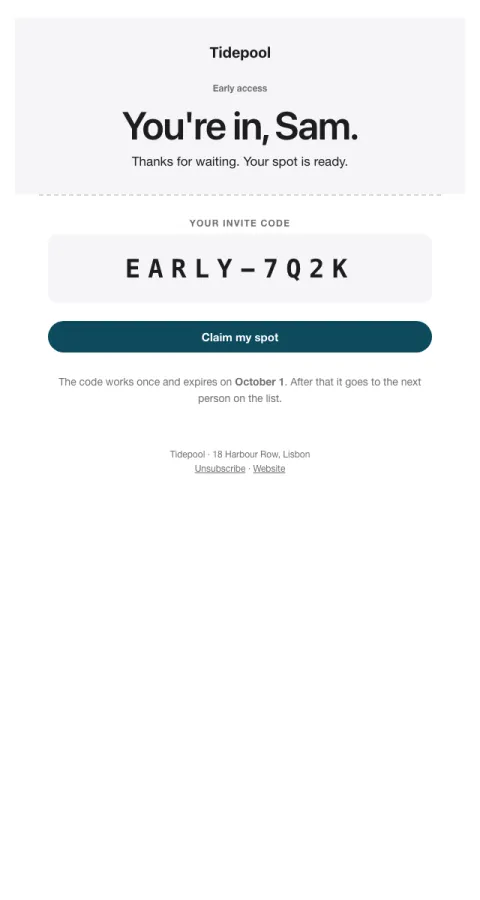 | **[You're in](beta-invite/)**<br>An invite code on a ticket with a real expiry. Exclusive because it is. | Software & apps, Community & nonprofit | Real exclusivity (a code, an expiry) creates urgency without tricks. |
|  | **[Offer · poster](promotion/)**<br>One offer on dark, one real deadline, the price anchor, one button. | Online shop, Software & apps, Creator & newsletter, Local business | A single offer with a real deadline and a visible anchor price. No fake countdowns. |
|  | **[New collection](new-collection/)**<br>A hero image and a two-by-two product grid with prices, then one 'shop all'. | Online shop, Local business | A visual grid lets people shop from the email; small-batch honesty adds urgency without tricks. |
| 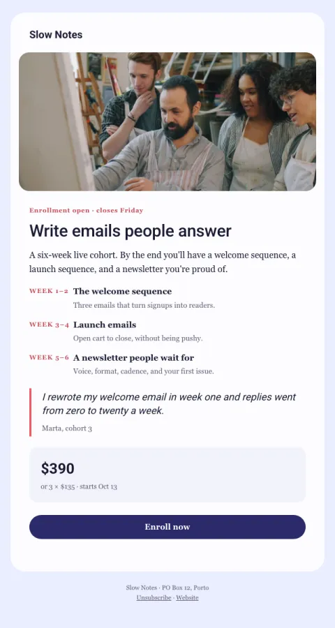 | **[Course launch](course-launch/)**<br>What they'll learn module by module, the price, a student quote, and enrollment dates. | Creator & newsletter, Services & agency | Concrete outcomes per module, social proof, and a real close date. The curriculum sells the course. |
| 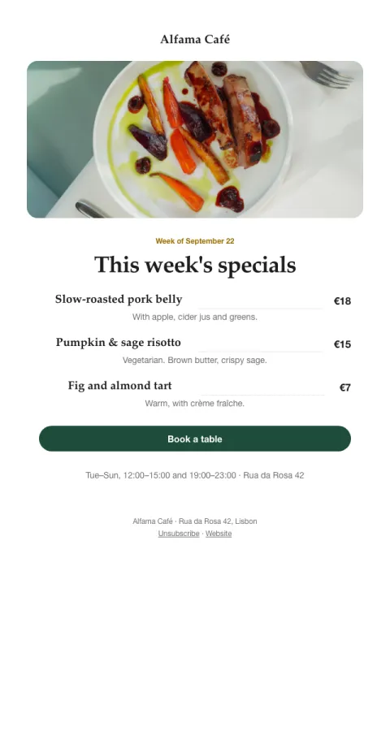 | **[This week's specials](weekly-specials/)**<br>A menu card for restaurants, cafés and bakeries: dishes, prices, and the hours. | Local business | A menu feels like an invitation, not an ad; limited-time specials give a reason to come this week. |
| 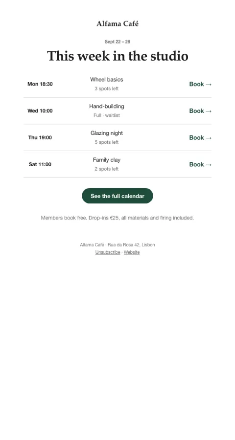 | **[This week's schedule](class-schedule/)**<br>A timetable for studios, gyms and workshops, with spots left and one-click booking. | Local business, Services & agency, Community & nonprofit | An at-a-glance timetable with real 'spots left' counts makes booking a two-second decision. |
| 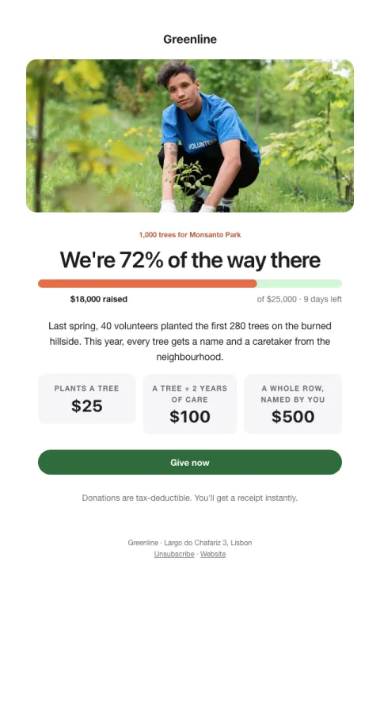 | **[Fundraising appeal](appeal/)**<br>Progress toward a goal, what each amount does, and a story of one person helped. | Community & nonprofit | Goal gradient (visible progress pulls people to help finish) plus concrete impact per amount. |
| 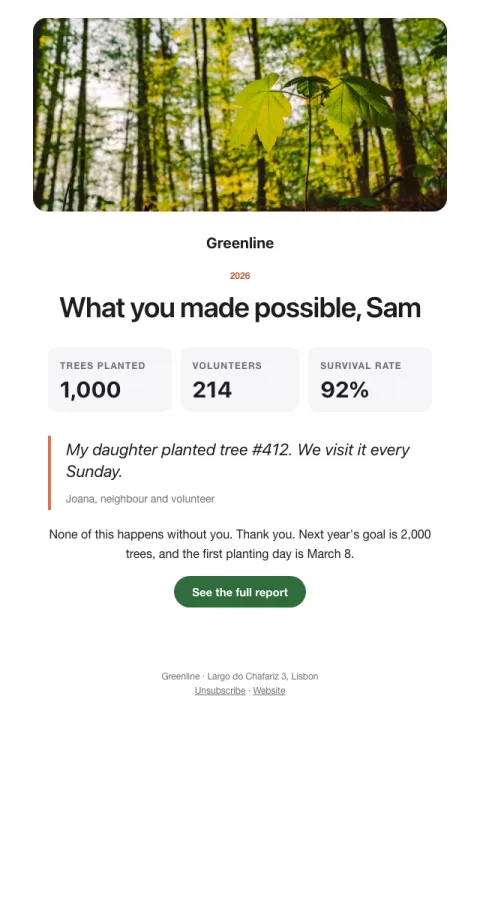 | **[Impact report](impact-report/)**<br>What supporters made possible: big numbers, one story, and a thank-you. | Community & nonprofit, Services & agency | Credit the reader ('you made this'), make impact concrete, then invite the next step softly. |
|  | **[Notice](notice/)**<br>Maintenance, holiday hours or a change, stated plainly with the when in a box. | Software & apps, Online shop, Creator & newsletter, Services & agency, Local business, Community & nonprofit | The 'when' in a box and a plain 'what you need to do' answer the only two questions people have. |
|  | **[Survey · first answer in the email](survey/)**<br>The first question answered in the email with one tap; the rest is optional. | Software & apps, Online shop, Creator & newsletter, Services & agency, Local business, Community & nonprofit | Answering the first question in the email gets far more responses; momentum carries some into the rest. |

### Account & orders

| | Template | For | Why it works |
| :---: | --- | --- | --- |
| 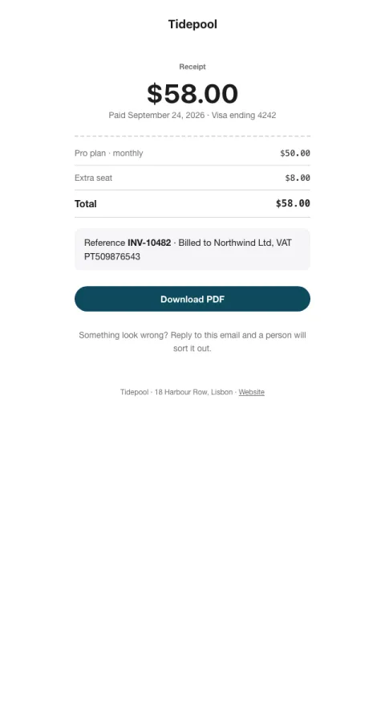 | **[Receipt](receipt/)**<br>A paper-style receipt with the total first, line items, and the order reference. | Software & apps, Online shop, Creator & newsletter, Services & agency, Local business, Community & nonprofit | Looks like a receipt: total first, then items, then the reference people search their inbox for. |
|  | **[Verify email](verify-email/)**<br>One large button to confirm an address, with the expiry and a safety note. | Software & apps, Online shop, Creator & newsletter, Services & agency, Local business, Community & nonprofit | A single, obvious action with nothing else to read. |
|  | **[Confirm subscription](confirm-subscription/)**<br>Double opt-in that says what's coming and how often, so fewer people mark you as spam. | Creator & newsletter, Community & nonprofit, Online shop, Services & agency, Local business | Sets expectations (what, how often) before the first real email, which lowers complaints later. |
|  | **[Magic link](magic-link/)**<br>Passwordless sign-in: one link, the device that asked, and when it expires. | Software & apps, Creator & newsletter, Community & nonprofit, Online shop | Shows which device asked so people trust it; nothing else competes with the link. |
|  | **[Password reset](password-reset/)**<br>Reset instructions with a clear expiry and a calm note for people who didn't ask. | Software & apps, Online shop, Creator & newsletter, Community & nonprofit | Names the account and the expiry; reassures that nothing changes if they ignore it. |
|  | **[Login code](login-code/)**<br>A large, spaced one-time code that's easy to read on a phone. | Software & apps, Online shop, Creator & newsletter, Community & nonprofit | Code in the subject for notification previews; large spaced digits in the body. |
|  | **[Invitation](invite/)**<br>A personal invitation that leads with the person who sent it. | Software & apps, Community & nonprofit, Services & agency | Leads with a face and a name the person knows; their note (when given) outweighs any product pitch. |
|  | **[New sign-in alert](security-alert/)**<br>Device, place and time in a card, with one clear action if it wasn't them. | Software & apps, Online shop, Creator & newsletter, Community & nonprofit | Specific details make it checkable at a glance; 'nothing to do if it was you' avoids alarm fatigue. |
|  | **[Policy update](policy-update/)**<br>A calm, scannable notice of what changes, when, and what it means for them. | Software & apps, Online shop, Creator & newsletter, Services & agency, Local business, Community & nonprofit | A plain summary up front, then the date, then the link. People trust notices they can understand in ten seconds. |
|  | **[Payment failed](payment-failed/)**<br>A calm dunning email: the card that failed, the retry date, and nothing lost yet. | Software & apps, Creator & newsletter, Services & agency, Community & nonprofit | Leads with 'nothing's changed yet', shows the exact card and a dated timeline. Calm and specific beats threats. |
|  | **[Renewal reminder](renewal-reminder/)**<br>A friendly heads-up before an annual renewal, which cuts refunds and chargebacks. | Software & apps, Creator & newsletter, Services & agency, Community & nonprofit | Transparency builds trust: amount, date, and a one-line recap of the value they got. |
|  | **[Plan changed](plan-change/)**<br>Confirms an upgrade or downgrade with what's included and the next invoice. | Software & apps, Creator & newsletter, Services & agency, Community & nonprofit | Turns a billing event into activation: one unlocked feature to try now. |
|  | **[Limit reached · slow, not fail](usage-alert/)**<br>Work over the limit is queued, not lost; upgrading sends it now. | Software & apps | Slow, not fail: nothing is lost and 'do nothing' is a real option, which makes paying feel like a choice, not a ransom. |
|  | **[Export ready](export-ready/)**<br>A file card with size and expiry, and one download button. | Software & apps, Community & nonprofit | The file card answers 'is this the right file?' before they click. |
|  | **[You were mentioned](mention/)**<br>The quoted comment with who wrote it, so people can answer without opening the app. | Software & apps, Community & nonprofit | Quoting the actual comment gives enough context to reply straight from the inbox. |
|  | **[Order confirmed](order-confirmed/)**<br>What they bought with pictures, when it arrives, and where it's going. | Online shop, Local business | Pictures of what they bought make the moment feel real; the delivery estimate answers the next question before it's asked. |
|  | **[Order shipped](order-shipped/)**<br>A four-stage tracker with today lit, the carrier, and the tracking link. | Online shop | A visual tracker makes progress feel faster than a sentence does. |
|  | **[Booking confirmed](booking-confirmed/)**<br>An appointment ticket: when, where, with whom, plus add-to-calendar and reschedule. | Services & agency, Local business | A ticket-like card plus calendar links: people who add it to a calendar show up. |
|  | **[Appointment reminder](booking-reminder/)**<br>A compact reminder the day before, with directions and what to bring. | Services & agency, Local business | The practical details (what to bring, where to park) remove the small frictions that cause no-shows. |

## Licence

MIT, like the rest of Bangerverse. Sample brands and copy are fictional. Banger names and logos remain their owners' trademarks.
