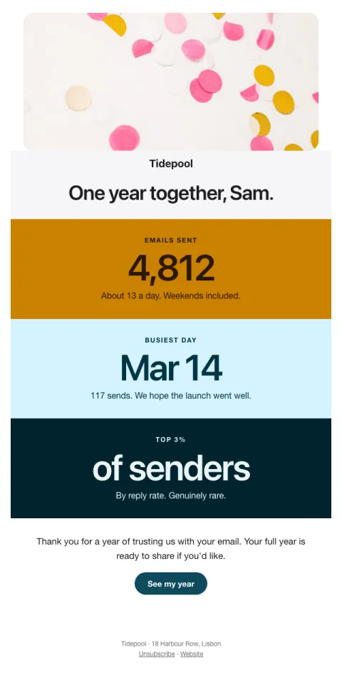

# Year in review

Full-bleed color blocks with big identity stats people want to share.

- **Its job:** Celebrate an anniversary and get it shared.
- **Send it:** On the account's anniversary (or in December for everyone).
- **Why it works:** Identity stats ('top 3%') people want to share because they say something good about them.
- **Measure:** Shares and 30-day retention
- **Keep:** personal stats; a share button
- **Avoid:** upsells

**Subject lines to test**

- {{first_name|there}}, one year of {{company_name}}
- Your year, in three numbers
- One year together

Slots: `preheader`, `hero_image`, `stat_1_label`, `stat_1`, `stat_1_note`, `stat_2_label`, `stat_2`, `stat_2_note`, `stat_3_label`, `stat_3`, `stat_3_note`, `thanks`, `cta_label`, `cta_url`
