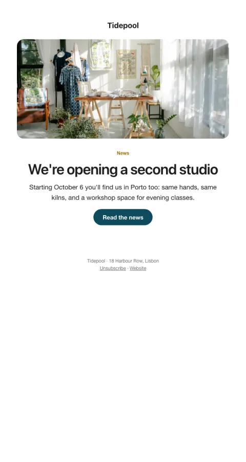

# Announcement

Your own hero image (or brand art), one headline, one reason to care, one button.

- **Its job:** Tell the whole list one important thing and get the click.
- **Send it:** Any single piece of news.
- **Why it works:** Image, headline, one paragraph, one button: nothing competes with the news.
- **Measure:** Click rate
- **Keep:** one piece of news
- **Avoid:** a second story

**Subject lines to test**

- {{headline}}
- News from {{company_name}}
- {{first_name|there}}, this one's big

Slots: `preheader`, `hero_image`, `hero_alt`, `eyebrow`, `headline`, `summary`, `cta_label`, `cta_url`
