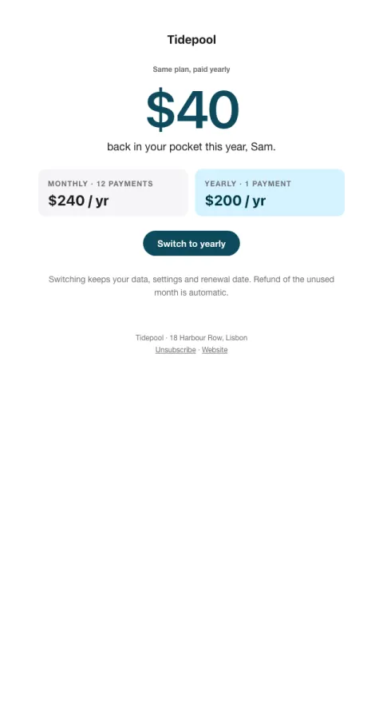

# Switch to annual

Their real yearly spend next to the annual price, with the saving as the big number.

- **Its job:** Move monthly customers to annual.
- **Send it:** After 3 paid months, or before a price change.
- **Why it works:** Shows the saving as one big concrete number computed from their own bill.
- **Measure:** Annual switches
- **Keep:** their numbers; the saving as the headline
- **Avoid:** fake deadlines

**Subject lines to test**

- Keep {{saving}} this year
- Two months free, same plan
- The math on going yearly

Slots: `preheader`, `saving`, `monthly_total`, `annual_total`, `cta_label`, `cta_url`, `terms`
