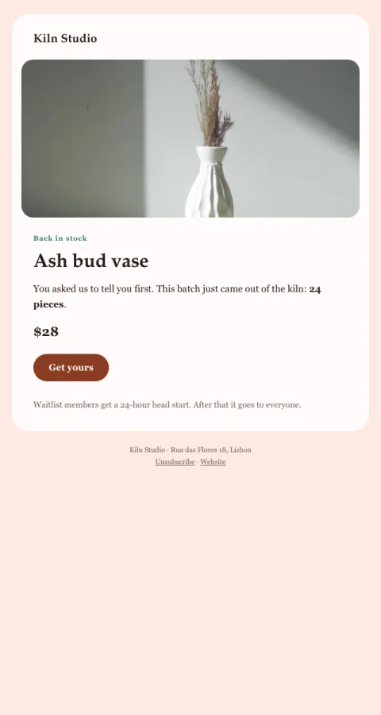

# Back in stock

The product they waited for, the real quantity left, and one button.

- **Its job:** Convert waitlisted demand before stock runs out.
- **Send it:** When a waitlisted product is restocked (waitlist first, then everyone).
- **Why it works:** Real scarcity (an honest batch size) and 'you asked us to tell you first'.
- **Measure:** Conversion from waitlist
- **Keep:** honest quantity; you-asked framing
- **Avoid:** fake countdowns

**Subject lines to test**

- It's back: {{product_name}}
- You asked us to tell you first
- {{product_name}} is restocked (24 made)

Slots: `preheader`, `product_image`, `product_alt`, `product_name`, `summary`, `quantity`, `product_price`, `cta_label`, `cta_url`, `fine_print`
