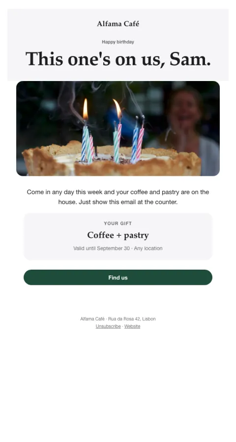

# Birthday treat

A warm birthday note with a gift that feels like a gift.

- **Its job:** Delight and bring a regular back in.
- **Send it:** A few days before the customer's birthday.
- **Why it works:** Reciprocity: a real gift with no strings creates goodwill that shows up as visits.
- **Measure:** Redemption rate
- **Keep:** a genuine gift; an easy redemption
- **Avoid:** minimum spend

**Subject lines to test**

- Happy birthday, {{first_name|there}}! This one's on us.
- A birthday treat for you
- For your birthday week

Slots: `preheader`, `eyebrow`, `headline`, `hero_image`, `message`, `gift`, `gift_terms`, `cta_label`, `cta_url`
