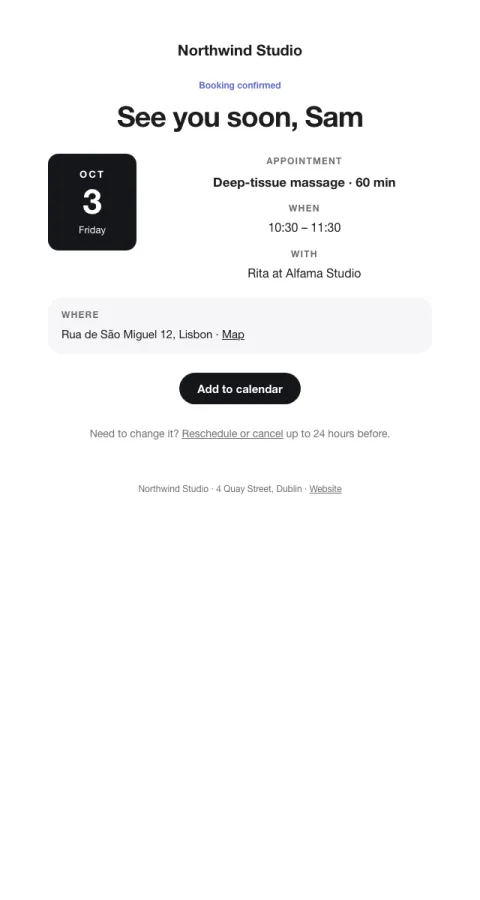

# Booking confirmed

An appointment ticket: when, where, with whom, plus add-to-calendar and reschedule.

- **Its job:** Confirm the booking and reduce no-shows.
- **Send it:** Immediately after a booking.
- **Why it works:** A ticket-like card plus calendar links: people who add it to a calendar show up.
- **Measure:** No-show rate
- **Keep:** date, time, place; calendar links; reschedule link
- **Avoid:** marketing

**Subject lines to test**

- You're booked: {{service_name}} on {{day_label}}
- See you {{day_label}}, {{first_name|there}}
- Booking confirmed

Slots: `preheader`, `month`, `day`, `weekday`, `service_name`, `time`, `staff_name`, `address`, `map_url`, `cta_label`, `cta_url`, `reschedule_url`, `cancel_window`
