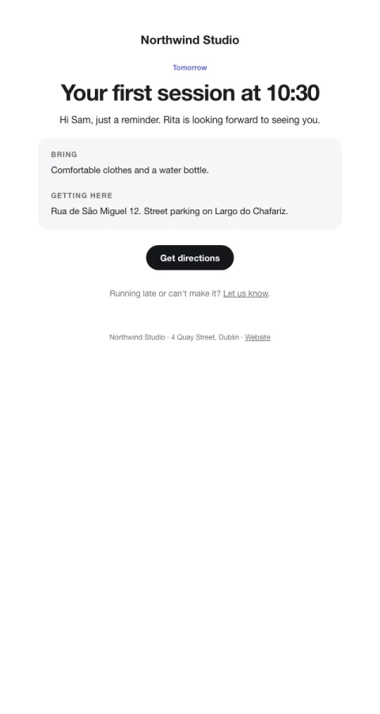

# Appointment reminder

A compact reminder the day before, with directions and what to bring.

- **Its job:** Get the person there on time.
- **Send it:** 24 hours (and optionally 2 hours) before.
- **Why it works:** The practical details (what to bring, where to park) remove the small frictions that cause no-shows.
- **Measure:** No-show rate
- **Keep:** time and place; what to bring
- **Avoid:** upsells

**Subject lines to test**

- Tomorrow at {{time}}: {{service_name}}
- See you tomorrow, {{first_name|there}}
- Reminder: {{service_name}} tomorrow

Slots: `preheader`, `service_name`, `time`, `with_whom`, `what_to_bring`, `directions`, `cta_label`, `cta_url`, `reschedule_url`
