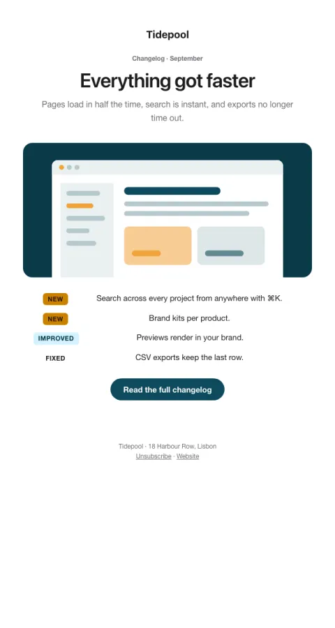

# What shipped

New, improved and fixed, tagged, with one screenshot for the headline change.

- **Its job:** Show momentum and drive adoption of the headline change.
- **Send it:** Monthly or biweekly.
- **Why it works:** Scannable tags let people find what they care about; one screenshot sells the headline change.
- **Measure:** Headline feature adoption
- **Keep:** tags; one headline change
- **Avoid:** internal ticket names

**Subject lines to test**

- What shipped in {{period}}
- {{period}}: faster everything, plus 11 fixes
- New this month at {{company_name}}

Slots: `preheader`, `period`, `headline`, `summary`, `screenshot_image`, `screenshot_alt`, `new_1`, `new_2`, `improved_1`, `fixed_1`, `cta_label`, `cta_url`
