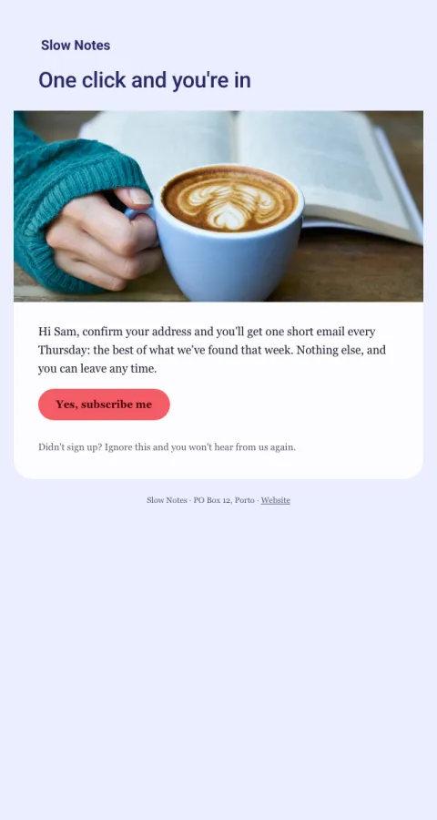

# Confirm subscription

Double opt-in that says what's coming and how often, so fewer people mark you as spam.

- **Its job:** Turn a form signup into a confirmed subscriber.
- **Send it:** Immediately after a newsletter or list signup.
- **Why it works:** Sets expectations (what, how often) before the first real email, which lowers complaints later.
- **Measure:** Confirmation rate
- **Keep:** what they'll get; how often
- **Avoid:** a second call to action

**Subject lines to test**

- One click to confirm your subscription
- Confirm, and the first issue is on its way
- Almost there: confirm your email

Slots: `preheader`, `headline`, `hero_image`, `promise`, `cta_label`, `cta_url`
