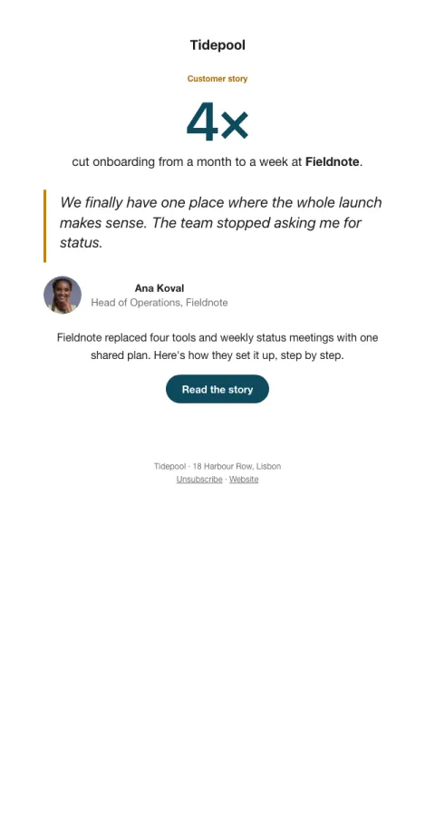

# Customer story

A big pull quote with a portrait, the one outcome number, and the story in brief.

- **Its job:** Turn proof into trials or demos.
- **Send it:** Monthly, or to prospects mid-consideration.
- **Why it works:** Social proof from someone like them, with one concrete number, beats any claim you can make.
- **Measure:** Trial or demo clicks
- **Keep:** one number; a real person's quote
- **Avoid:** vague praise

**Subject lines to test**

- How {{customer_company}} {{outcome}}
- “{{customer_quote}}”
- {{outcome}}: the {{customer_company}} story

Slots: `preheader`, `outcome_number`, `outcome`, `customer_company`, `customer_quote`, `customer_photo`, `customer_initials`, `customer_name`, `customer_role`, `story_summary`, `cta_label`, `cta_url`
