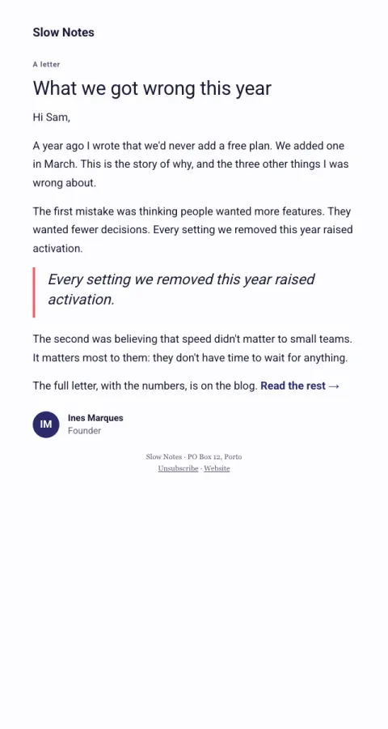

# Founder letter

A long-form letter in a reading column with one pull quote and one link at the end.

- **Its job:** Build trust and authority with long-form writing.
- **Send it:** Monthly or on a big moment (anniversary, lessons, pivots).
- **Why it works:** Personal, honest writing earns attention that promotional mail never gets.
- **Measure:** Replies and read-through clicks
- **Keep:** personal voice; one link at the end
- **Avoid:** images mid-text; multiple buttons

**Subject lines to test**

- {{title}}
- What we got wrong this year
- A longer letter this week

Slots: `preheader`, `kicker`, `title`, `paragraph_1`, `paragraph_2`, `pull_quote`, `paragraph_3`, `closing`, `link_label`, `cta_url`, `sender_initials`, `sender_name`, `sender_role`
