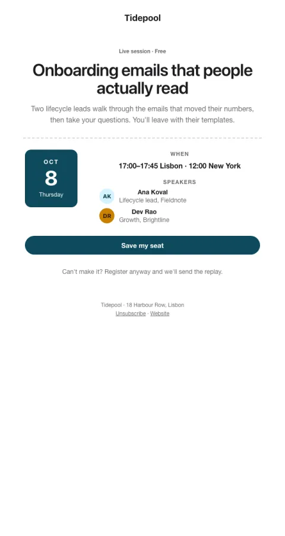

# Event invite

A ticket: date block, time in two zones, speakers, and 'register anyway for the replay'.

- **Its job:** Get registrations.
- **Send it:** 2–3 weeks before, then a reminder a week out.
- **Why it works:** A ticket feels like a seat, not a marketing email. 'Register anyway for the replay' catches people who can't make the time.
- **Measure:** Registration rate
- **Keep:** date block; time zones; replay line
- **Avoid:** long agendas

**Subject lines to test**

- You're invited: {{event_name}} · {{day_label}}
- 45 minutes with two practitioners
- Save your seat for {{day_label}}

Slots: `preheader`, `event_type`, `event_name`, `event_summary`, `month`, `day`, `weekday`, `time`, `speaker_1_initials`, `speaker_1_name`, `speaker_1_role`, `speaker_2_initials`, `speaker_2_name`, `speaker_2_role`, `cta_label`, `cta_url`
