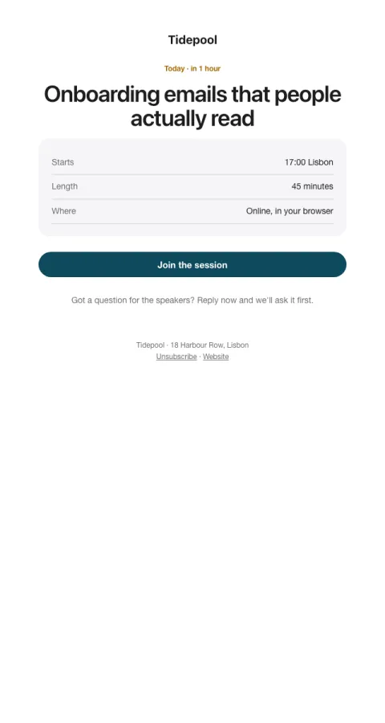

# Starts soon

A compact stub: the time in their words, one join button, and how to ask questions.

- **Its job:** Turn registrations into attendance.
- **Send it:** 1 hour before (and 24 hours before).
- **Why it works:** The join link where they'll look for it, and a nudge to bring a question (people who plan to ask show up).
- **Measure:** Attendance rate
- **Keep:** join button; the time
- **Avoid:** agenda repeats

**Subject lines to test**

- We start in 1 hour
- Starting soon: {{event_name}}
- Your link for today

Slots: `preheader`, `when_label`, `event_name`, `time`, `length`, `where`, `cta_label`, `cta_url`, `question_prompt`
