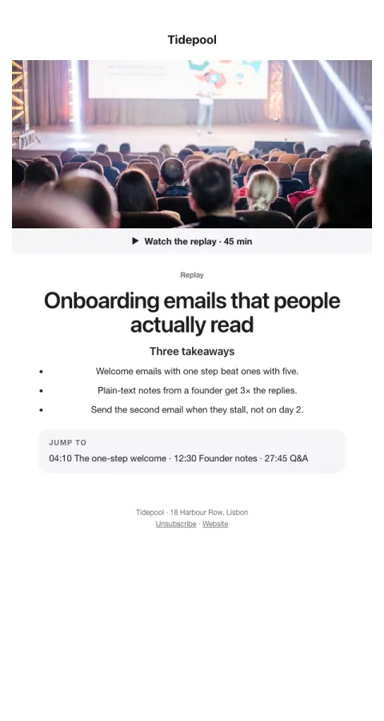

# Replay

A video thumbnail with a play button, three takeaways, and timestamps to jump to.

- **Its job:** Get registrants (and no-shows) to watch.
- **Send it:** Within 24 hours of the event.
- **Why it works:** Takeaways deliver value even without a click; timestamps lower the cost of watching.
- **Measure:** Replay views
- **Keep:** timestamps; takeaways
- **Avoid:** sending only a link

**Subject lines to test**

- The replay, plus 3 takeaways
- Missed it? Here's the 45-minute replay
- Skip to minute 12

Slots: `preheader`, `cta_url`, `video_thumbnail`, `cta_label`, `length`, `event_name`, `takeaway_1`, `takeaway_2`, `takeaway_3`, `timestamps`
