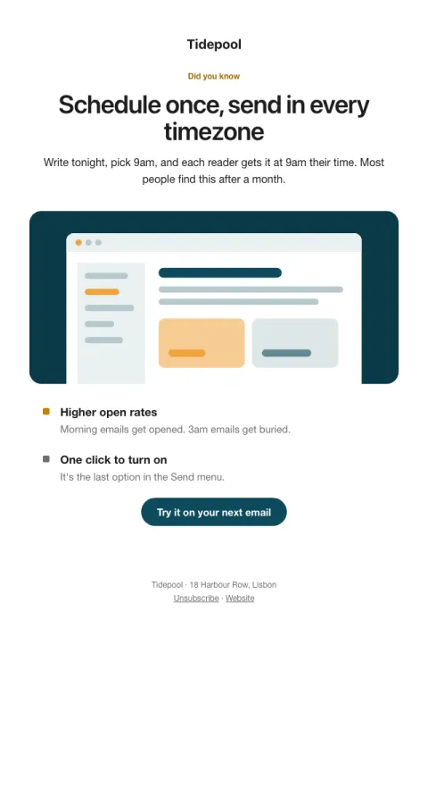

# Feature spotlight

One feature they haven't used, one screenshot, one deep link straight into it.

- **Its job:** Get one underused feature adopted.
- **Send it:** To users who haven't tried the feature after 7 days.
- **Why it works:** One feature per email, shown not described, with a deep link that drops them right into it.
- **Measure:** Feature used within 7 days
- **Keep:** one feature; deep link
- **Avoid:** listing several features

**Subject lines to test**

- The shortcut most people miss
- Try this: {{feature_name}}
- 30 seconds that save an hour a week

Slots: `preheader`, `headline`, `summary`, `screenshot_image`, `screenshot_alt`, `benefit_1_title`, `benefit_1_body`, `benefit_2_title`, `benefit_2_body`, `cta_label`, `cta_url`
