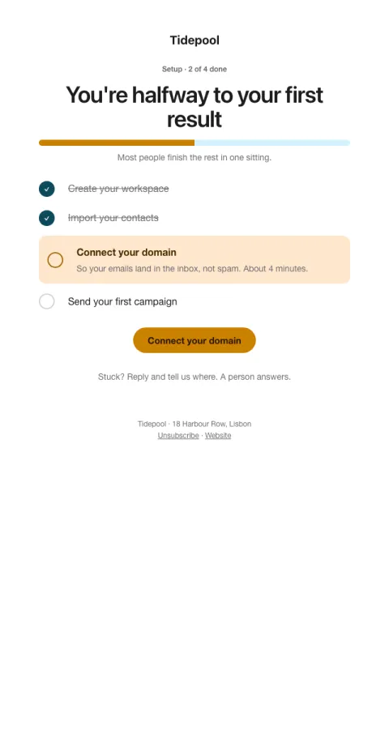

# Setup progress

Endowed progress: finished steps first, then one highlighted next step with its time cost.

- **Its job:** Get the next setup step done.
- **Send it:** 24–48h after signup if setup isn't finished.
- **Why it works:** Endowed progress: showing what's already done makes finishing feel close. The next step names its time cost.
- **Measure:** Next step done within 48h
- **Keep:** done steps shown first; time cost of the next step
- **Avoid:** listing every feature

**Subject lines to test**

- You're 2 steps from your first result
- Halfway there, {{first_name|there}}
- 4 minutes to finish setup

Slots: `preheader`, `progress_label`, `headline`, `step_1`, `step_2`, `step_3`, `step_3_note`, `step_4`, `cta_label`, `cta_url`
