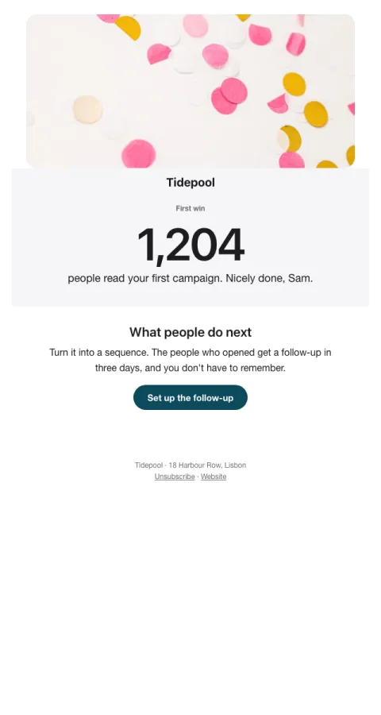

# First win

Celebrates the activation moment and points to the next habit while the feeling is fresh.

- **Its job:** Turn a first success into a habit.
- **Send it:** Right after the activation event.
- **Why it works:** Peak moment: celebrate the win, then attach the next habit while motivation is highest.
- **Measure:** Day-7 retention
- **Keep:** their number; one next step
- **Avoid:** upsells

**Subject lines to test**

- You did it, {{first_name|there}}: {{stat}} {{stat_label}}
- That's a first, {{first_name|there}}
- Nice work. What's next?

Slots: `preheader`, `hero_image`, `stat`, `stat_label`, `next_title`, `next_body`, `cta_label`, `cta_url`
