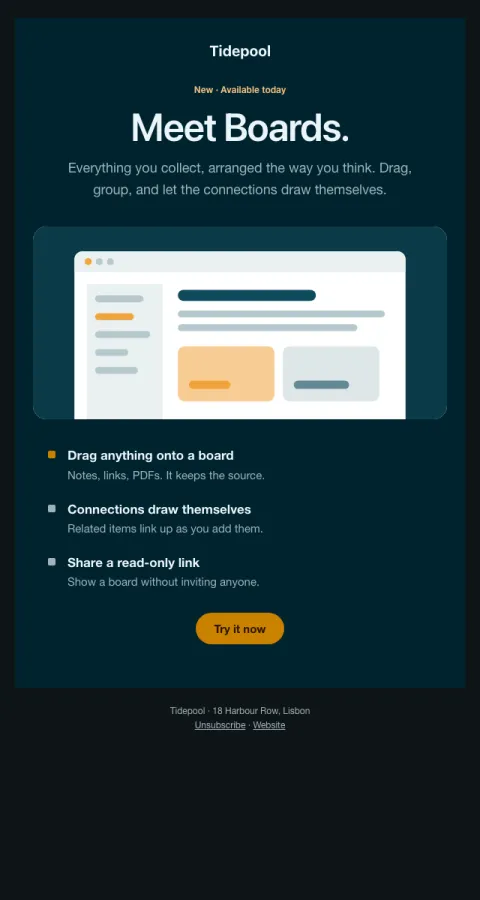

# Product launch

Keynote framing on dark: a name, a sentence, a product shot, three concrete benefits.

- **Its job:** Get existing users to try the new thing today.
- **Send it:** Launch day.
- **Why it works:** One name, one sentence, one picture, three benefits. Dark stands out in a light inbox.
- **Measure:** Tried within 7 days
- **Keep:** the feature name as the headline; three benefits max
- **Avoid:** jargon; a changelog dump

**Subject lines to test**

- New in {{company_name}}: {{feature_name}}
- Meet {{feature_name}}
- You asked for this one

Slots: `preheader`, `feature_name`, `summary`, `screenshot_image`, `screenshot_alt`, `benefit_1_title`, `benefit_1_body`, `benefit_2_title`, `benefit_2_body`, `benefit_3_title`, `benefit_3_body`, `cta_label`, `cta_url`
