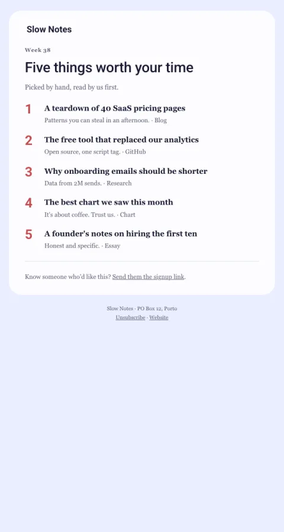

# Five things this week

A numbered list of five links, one line each, with where they're from.

- **Its job:** Deliver value in 60 seconds and earn the next open.
- **Send it:** Weekly.
- **Why it works:** A fixed, countable format people learn to trust; one line each respects their time.
- **Measure:** Clicks per open
- **Keep:** exactly five; one line each; the source
- **Avoid:** long intros

**Subject lines to test**

- 5 things worth your time this week
- This week: a pricing teardown and a very good chart
- Five links, five minutes

Slots: `preheader`, `issue_label`, `headline`, `intro`, `item_1_url`, `item_1_title`, `item_1_note`, `item_2_url`, `item_2_title`, `item_2_note`, `item_3_url`, `item_3_title`, `item_3_note`, `item_4_url`, `item_4_title`, `item_4_note`, `item_5_url`, `item_5_title`, `item_5_note`, `share_url`
