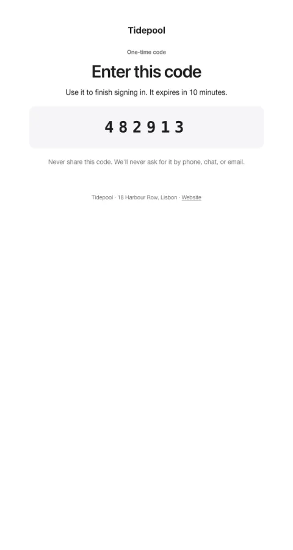

# Login code

A large, spaced one-time code that's easy to read on a phone.

- **Its job:** Deliver the code so it can be typed in seconds.
- **Send it:** When a one-time code is requested.
- **Why it works:** Code in the subject for notification previews; large spaced digits in the body.
- **Measure:** Sign-in completion
- **Keep:** the code in the subject; never-share warning
- **Avoid:** links; images

**Subject lines to test**

- {{code}} is your {{company_name}} code
- Your code: {{code}}
- {{company_name}} sign-in code

Slots: `preheader`, `headline`, `expires_in`, `code`
