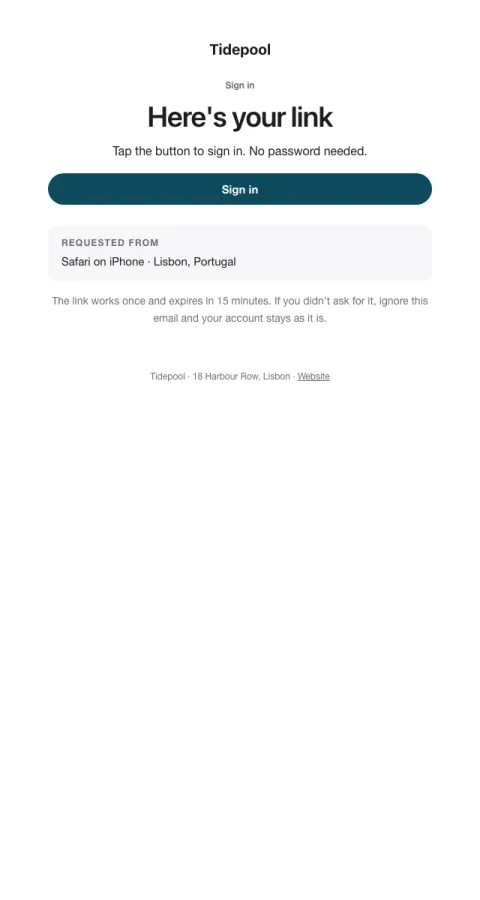

# Magic link

Passwordless sign-in: one link, the device that asked, and when it expires.

- **Its job:** Sign the person in within seconds.
- **Send it:** When someone requests a sign-in link.
- **Why it works:** Shows which device asked so people trust it; nothing else competes with the link.
- **Measure:** Sign-in completion
- **Keep:** expiry; requesting device
- **Avoid:** images; marketing

**Subject lines to test**

- Your sign-in link for {{company_name}}
- Sign in to {{company_name}}
- Here's your link

Slots: `preheader`, `headline`, `cta_label`, `cta_url`, `requested_from`, `expires_in`
