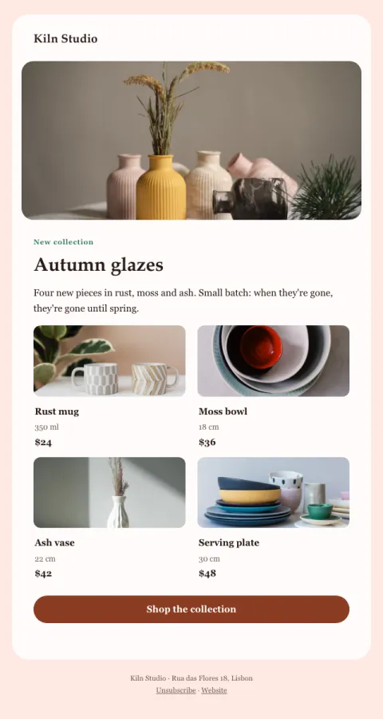

# New collection

A hero image and a two-by-two product grid with prices, then one 'shop all'.

- **Its job:** Sell a new collection.
- **Send it:** Launch day (VIPs first, a day earlier).
- **Why it works:** A visual grid lets people shop from the email; small-batch honesty adds urgency without tricks.
- **Measure:** Revenue per recipient
- **Keep:** product photos with prices; one 'shop all'
- **Avoid:** more than six products

**Subject lines to test**

- New: {{collection_name}}
- Four new pieces, just out of the kiln
- The {{collection_name}} collection is here

Slots: `preheader`, `hero_image`, `hero_alt`, `collection_name`, `summary`, `product_1_image`, `product_1_name`, `product_1_detail`, `product_1_price`, `product_1_url`, `product_2_image`, `product_2_name`, `product_2_detail`, `product_2_price`, `product_2_url`, `product_3_image`, `product_3_name`, `product_3_detail`, `product_3_price`, `product_3_url`, `product_4_image`, `product_4_name`, `product_4_detail`, `product_4_price`, `product_4_url`, `cta_label`, `cta_url`
