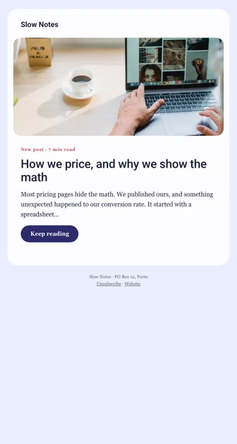

# New post

One new article or video: cover image, title, a tempting first paragraph, read time.

- **Its job:** Send readers to a new piece.
- **Send it:** When a new post, episode or video goes out.
- **Why it works:** The first paragraph is the hook; ending mid-thought makes the click feel like finishing a sentence.
- **Measure:** Click rate
- **Keep:** cover; read time
- **Avoid:** summarizing the whole post

**Subject lines to test**

- {{post_title}}
- New: {{post_title}}
- {{first_name|there}}, this one's for you

Slots: `preheader`, `cover_image`, `cover_alt`, `post_type`, `read_time`, `post_title`, `post_hook`, `cta_label`, `cta_url`
