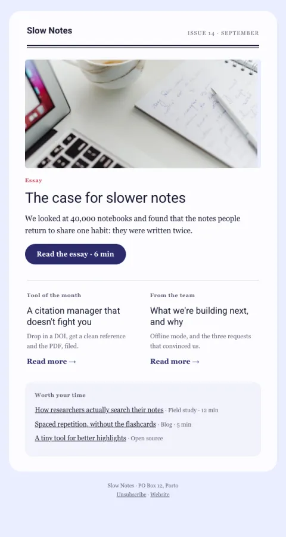

# Newsletter · editorial

A magazine masthead, one lead story with an image, two secondary stories and a short link list.

- **Its job:** Build a reading habit (clicks, not conversions).
- **Send it:** On a steady cadence (weekly or monthly).
- **Why it works:** Magazine hierarchy: one lead story earns the open, secondary stories and links reward scanning.
- **Measure:** Click-to-open rate and opens over time
- **Keep:** one lead story; the masthead
- **Avoid:** more than six links

**Subject lines to test**

- {{issue_label}}: {{lead_title}}
- {{lead_title}}
- The notes people return to

Slots: `preheader`, `issue_label`, `issue_date`, `lead_image`, `lead_image_alt`, `lead_kicker`, `lead_title`, `lead_dek`, `cta_label`, `cta_url`, `story_2_kicker`, `story_2_title`, `story_2_body`, `story_2_url`, `story_3_kicker`, `story_3_title`, `story_3_body`, `story_3_url`, `link_1_url`, `link_1_title`, `link_1_source`, `link_2_url`, `link_2_title`, `link_2_source`, `link_3_url`, `link_3_title`, `link_3_source`
