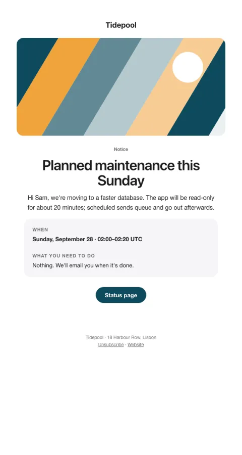

# Notice

Maintenance, holiday hours or a change, stated plainly with the when in a box.

- **Its job:** Inform everyone of an operational change, without alarm.
- **Send it:** A few days before the change.
- **Why it works:** The 'when' in a box and a plain 'what you need to do' answer the only two questions people have.
- **Measure:** Support tickets about the change
- **Keep:** when; what to do
- **Avoid:** marketing

**Subject lines to test**

- {{notice_title}}
- Heads-up: {{notice_title}}
- Our hours over the holidays

Slots: `preheader`, `hero_image`, `notice_title`, `notice_body`, `when`, `action_needed`, `cta_label`, `cta_url`
