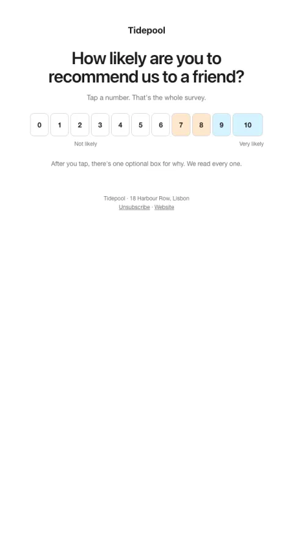

# NPS · answer in the email

Tapping a number is the answer. No survey to open.

- **Its job:** Collect a score from as many customers as possible.
- **Send it:** Quarterly, or 30 days after signup.
- **Why it works:** The survey is inside the email; one tap records the answer. Several times the responses of 'click to open a survey'.
- **Measure:** Response rate
- **Keep:** answers as links; the 'that's the whole survey' promise
- **Avoid:** follow-up questions in the email

**Subject lines to test**

- One click: would you recommend {{company_name}}?
- Quick one: 0 to 10?
- How are we doing, {{first_name|there}}?

Slots: `preheader`, `question`, `answer_url_0`, `answer_url_1`, `answer_url_2`, `answer_url_3`, `answer_url_4`, `answer_url_5`, `answer_url_6`, `answer_url_7`, `answer_url_8`, `answer_url_9`, `answer_url_10`, `followup`
