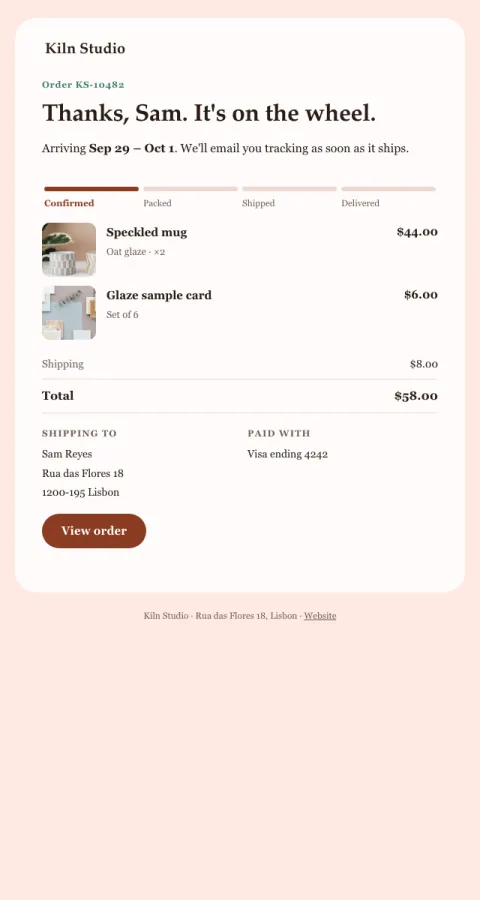

# Order confirmed

What they bought with pictures, when it arrives, and where it's going.

- **Its job:** Reassure the buyer and prevent 'did my order go through?' tickets.
- **Send it:** Immediately after checkout.
- **Why it works:** Pictures of what they bought make the moment feel real; the delivery estimate answers the next question before it's asked.
- **Measure:** Order-status tickets per 100 orders
- **Keep:** item photos; delivery estimate; address
- **Avoid:** cross-sells above the order

**Subject lines to test**

- Order {{order_id}} confirmed: arriving {{delivery_estimate}}
- Thanks, {{first_name|there}}! Your order is in
- We've got your order

Slots: `preheader`, `order_id`, `delivery_estimate`, `item_1_image`, `item_1_name`, `item_1_detail`, `item_1_price`, `item_2_image`, `item_2_name`, `item_2_detail`, `item_2_price`, `shipping`, `total`, `address`, `payment_method`, `cta_label`, `cta_url`
