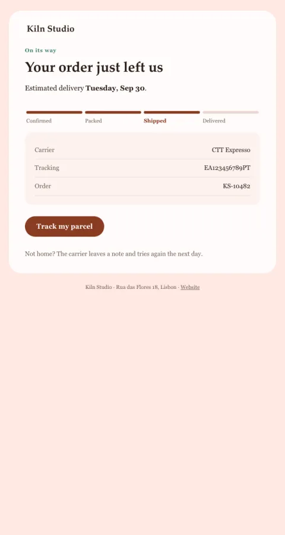

# Order shipped

A four-stage tracker with today lit, the carrier, and the tracking link.

- **Its job:** Answer 'where is it?' before it's asked.
- **Send it:** When the carrier scans the parcel.
- **Why it works:** A visual tracker makes progress feel faster than a sentence does.
- **Measure:** Where-is-my-order tickets
- **Keep:** tracker; carrier and tracking number
- **Avoid:** promotions above the fold

**Subject lines to test**

- Your order is on its way
- Shipped! Arriving {{delivery_estimate}}
- {{first_name|there}}, it's out the door

Slots: `preheader`, `headline`, `delivery_estimate`, `carrier`, `tracking_number`, `order_id`, `cta_label`, `cta_url`
