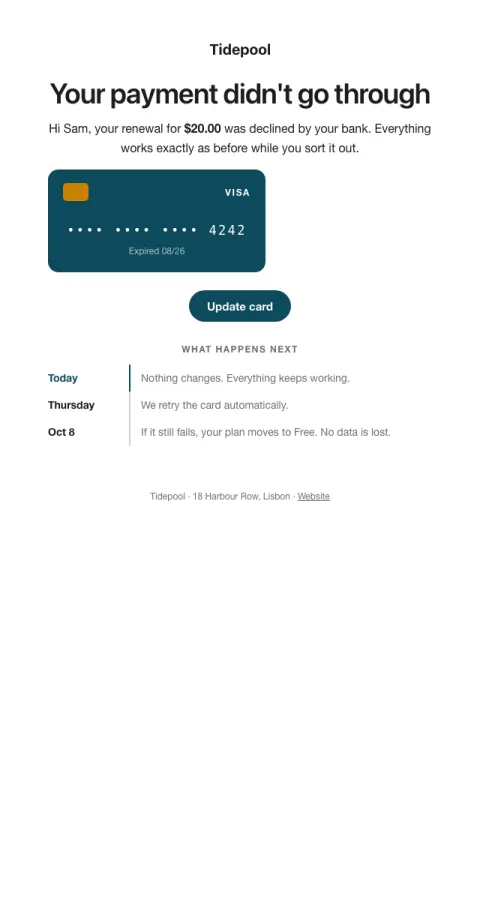

# Payment failed

A calm dunning email: the card that failed, the retry date, and nothing lost yet.

- **Its job:** Get the card updated before the next retry.
- **Send it:** Right after a failed renewal; follow up before each retry.
- **Why it works:** Leads with 'nothing's changed yet', shows the exact card and a dated timeline. Calm and specific beats threats.
- **Measure:** Recovered payments within 14 days
- **Keep:** nothing changed yet; the dated timeline; no data lost
- **Avoid:** threats; all caps; urgency words

**Subject lines to test**

- Your card was declined. Nothing's changed yet.
- Update your card for {{company_name}}
- We'll retry your payment on Thursday

Slots: `preheader`, `headline`, `amount`, `card_brand`, `card_last4`, `card_note`, `cta_label`, `cta_url`, `step_today`, `retry_date`, `final_date`, `final_step`
