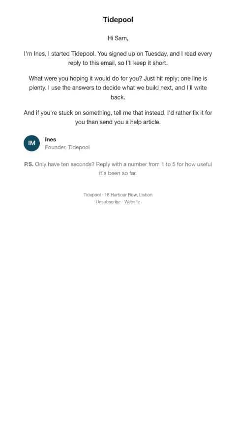

# Personal note

A plain, signed note from a real person with one easy question to reply to.

- **Its job:** Start a conversation.
- **Send it:** A day or two after signup, from a founder or owner.
- **Why it works:** Looks like a personal email, so it gets read like one. Replies improve inbox placement and tell you what to build.
- **Measure:** Reply rate (aim for 5%+)
- **Keep:** lowercase, personal subject; one question; the signature
- **Avoid:** images; buttons; links

**Subject lines to test**

- quick question, {{first_name|there}}
- why did you sign up?
- from Ines at {{company_name}}

Slots: `preheader`, `intro`, `message`, `question`, `offer_help`, `sender_initials`, `sender_name`, `sender_role`, `ps`
