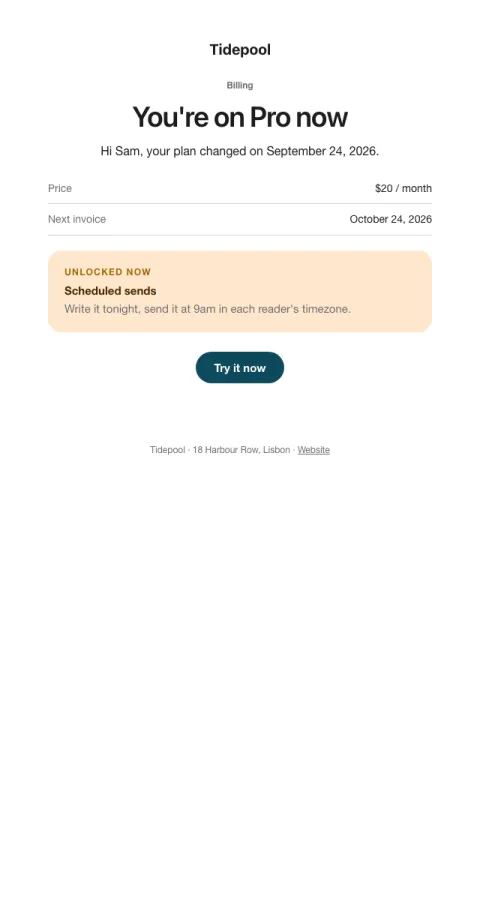

# Plan changed

Confirms an upgrade or downgrade with what's included and the next invoice.

- **Its job:** Confirm the change and point to the first thing to try on the new plan.
- **Send it:** Immediately after a plan change.
- **Why it works:** Turns a billing event into activation: one unlocked feature to try now.
- **Measure:** Use of a new-plan feature within 7 days
- **Keep:** price and next invoice; one thing to try
- **Avoid:** upsells

**Subject lines to test**

- You're on {{plan_name}} now
- Welcome to {{plan_name}}
- Your plan change is confirmed

Slots: `preheader`, `plan_name`, `effective_date`, `price`, `next_invoice`, `unlocked_title`, `unlocked_body`, `cta_label`, `cta_url`
