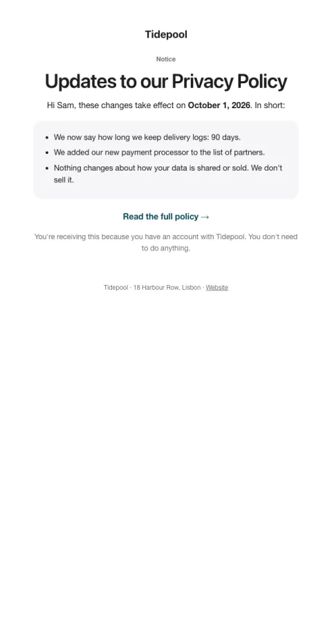

# Policy update

A calm, scannable notice of what changes, when, and what it means for them.

- **Its job:** Inform (and meet legal notice duties) without alarming anyone.
- **Send it:** At least 30 days before a policy takes effect.
- **Why it works:** A plain summary up front, then the date, then the link. People trust notices they can understand in ten seconds.
- **Measure:** Complaints and support tickets
- **Keep:** effective date; a plain summary
- **Avoid:** legalese in the summary; promotions

**Subject lines to test**

- Updates to our {{policy_name}}
- What's changing on October 1
- A plain-English summary of our new terms

Slots: `preheader`, `policy_name`, `effective_date`, `change_1`, `change_2`, `change_3`, `cta_label`, `cta_url`
