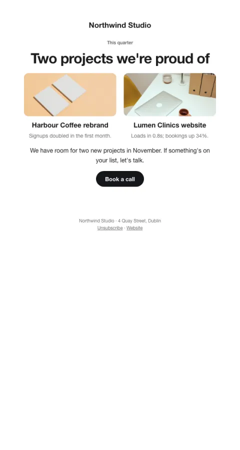

# Recent work

Two projects with images and the result each achieved; one 'let's talk' button.

- **Its job:** Remind past and potential clients what you do, with proof.
- **Send it:** Quarterly.
- **Why it works:** Show, don't tell: results next to images make the case without a pitch.
- **Measure:** Replies and discovery calls
- **Keep:** result per project; one CTA
- **Avoid:** client names without permission

**Subject lines to test**

- Two projects we're proud of this quarter
- A rebrand that doubled signups
- What we've been making

Slots: `preheader`, `period`, `headline`, `project_1_image`, `project_1_alt`, `project_1_title`, `project_1_result`, `project_2_image`, `project_2_alt`, `project_2_title`, `project_2_result`, `closing`, `cta_label`, `cta_url`
