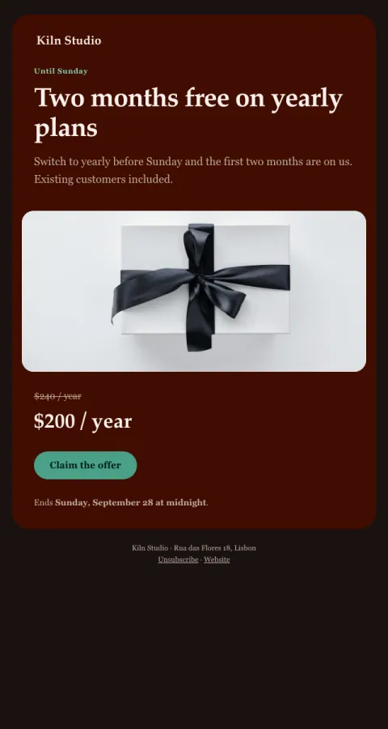

# Offer · poster

One offer on dark, one real deadline, the price anchor, one button.

- **Its job:** Drive purchases during a real promotion.
- **Send it:** Start of the offer, plus one last-day reminder.
- **Why it works:** A single offer with a real deadline and a visible anchor price. No fake countdowns.
- **Measure:** Revenue per recipient
- **Keep:** one offer; a real deadline
- **Avoid:** fake countdown timers; stacked offers

**Subject lines to test**

- {{offer_headline}}
- Ends Sunday: {{offer_headline}}
- Our only sale this year

Slots: `preheader`, `eyebrow`, `offer_headline`, `offer_detail`, `hero_image`, `anchor_price`, `offer_price`, `cta_label`, `cta_url`, `deadline`
