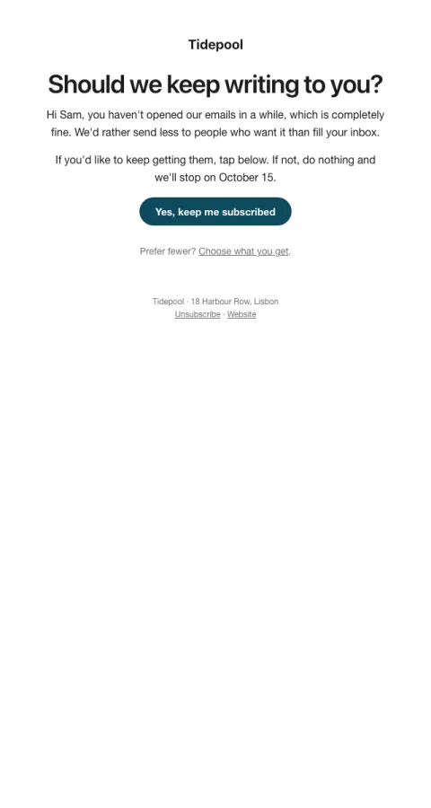

# Still want these?

Asks quiet readers to reconfirm before you stop sending, which protects deliverability.

- **Its job:** Clean the list without losing people who still care.
- **Send it:** To contacts with no opens or clicks in 90–120 days.
- **Why it works:** Honest re-permission. Removing silent contacts improves inbox placement for everyone who stays.
- **Measure:** Reconfirm rate; complaint rate afterwards
- **Keep:** the honest 'we'll stop' promise; one button
- **Avoid:** guilt trips

**Subject lines to test**

- Should we keep writing to you?
- Still want these emails?
- One click to stay subscribed

Slots: `preheader`, `headline`, `promise`, `cta_label`, `cta_url`, `preferences_url`
