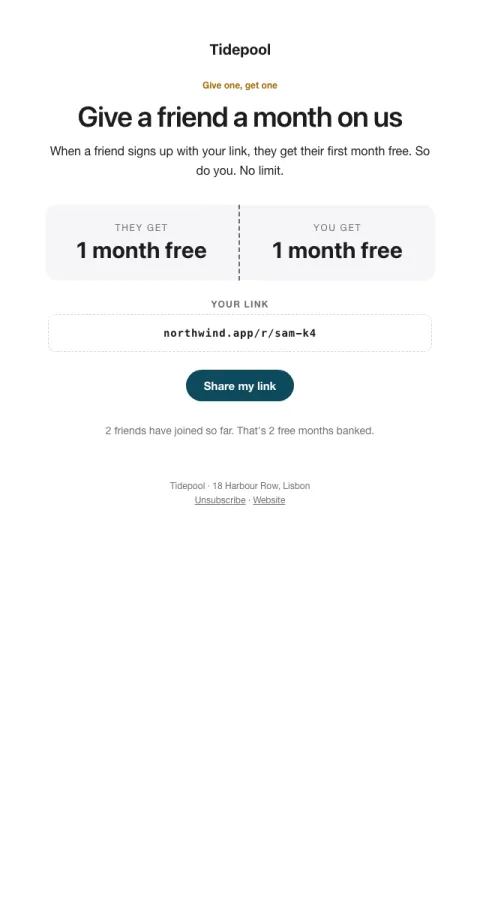

# Give one, get one

A double-sided reward, their personal link, and progress toward the reward.

- **Its job:** Get happy customers to refer friends.
- **Send it:** After a positive moment (NPS 9–10, a milestone), not at signup.
- **Why it works:** Double-sided rewards feel generous rather than salesy; a personal link and progress make it concrete.
- **Measure:** Referrals sent per email
- **Keep:** both sides of the reward; their link
- **Avoid:** complex terms in the body

**Subject lines to test**

- Give a friend a month on us
- A month free for you and a friend
- Know someone who'd love this?

Slots: `preheader`, `headline`, `summary`, `give`, `get`, `referral_link`, `cta_label`, `cta_url`, `progress_note`
