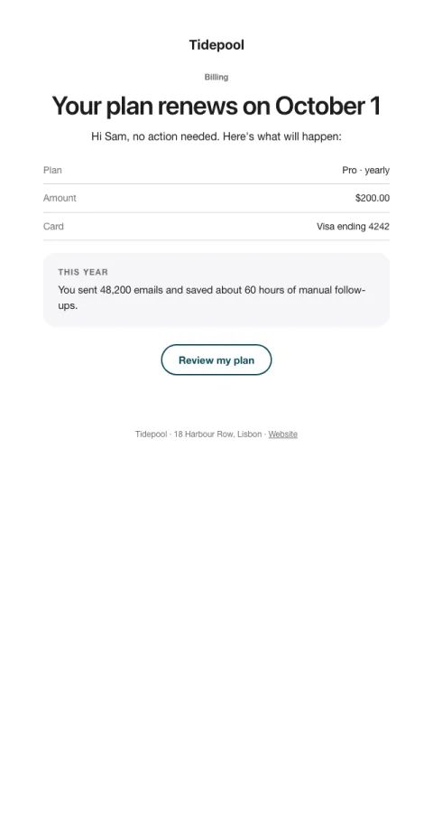

# Renewal reminder

A friendly heads-up before an annual renewal, which cuts refunds and chargebacks.

- **Its job:** Prevent surprise charges (and the refunds and disputes they cause).
- **Send it:** 7–14 days before an annual renewal.
- **Why it works:** Transparency builds trust: amount, date, and a one-line recap of the value they got.
- **Measure:** Refund and chargeback rate on renewals
- **Keep:** amount and date; how to change plans
- **Avoid:** pressure; discount offers

**Subject lines to test**

- Your {{plan_name}} plan renews on {{renewal_date}}
- Heads-up: renewal in 7 days
- Your year with {{company_name}}, and what's next

Slots: `preheader`, `renewal_date`, `plan_name`, `amount`, `card`, `value_recap`, `cta_label`, `cta_url`
