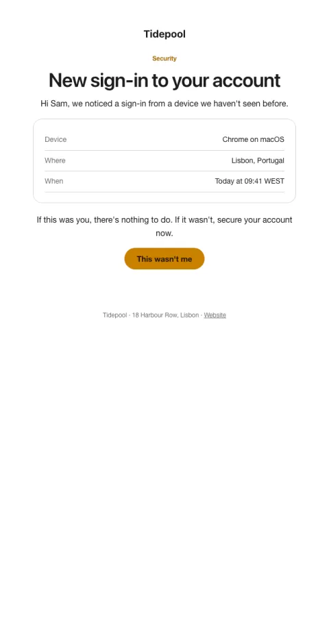

# New sign-in alert

Device, place and time in a card, with one clear action if it wasn't them.

- **Its job:** Let people spot and stop account takeover.
- **Send it:** On a sign-in from a new device or location.
- **Why it works:** Specific details make it checkable at a glance; 'nothing to do if it was you' avoids alarm fatigue.
- **Measure:** Time to secure a compromised account
- **Keep:** device, place, time; not-you action
- **Avoid:** marketing; vague wording

**Subject lines to test**

- New sign-in to your {{company_name}} account
- Was this you?
- New device signed in

Slots: `preheader`, `headline`, `device`, `location`, `when`, `cta_label`, `cta_url`
