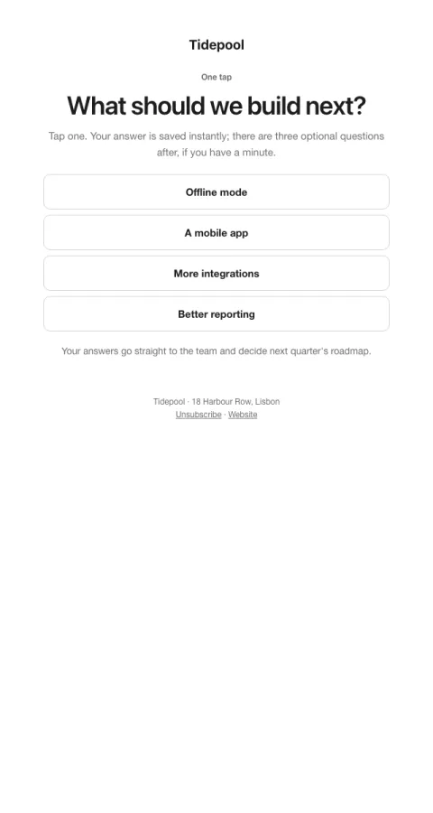

# Survey · first answer in the email

The first question answered in the email with one tap; the rest is optional.

- **Its job:** Collect research answers at scale.
- **Send it:** Whenever you need input from the list.
- **Why it works:** Answering the first question in the email gets far more responses; momentum carries some into the rest.
- **Measure:** Response rate
- **Keep:** first answer in the email
- **Avoid:** more than five options

**Subject lines to test**

- {{question}}
- Quick question, one tap
- Help decide what we build next

Slots: `preheader`, `eyebrow`, `question`, `intro`, `option_1`, `option_2`, `option_3`, `option_4`, `answer_url_0`, `answer_url_1`, `answer_url_2`, `answer_url_3`, `why`
