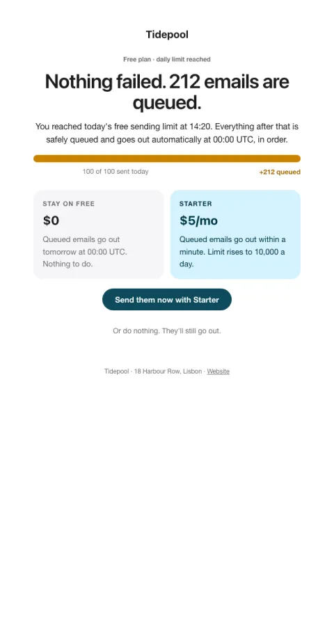

# Limit reached · slow, not fail

Work over the limit is queued, not lost; upgrading sends it now.

- **Its job:** Upgrade at the moment of need without breaking trust.
- **Send it:** When a free limit is reached (and at 80% as a softer heads-up).
- **Why it works:** Slow, not fail: nothing is lost and 'do nothing' is a real option, which makes paying feel like a choice, not a ransom.
- **Measure:** Upgrade within 24h; complaint rate
- **Keep:** nothing is lost; the do-nothing option; exact numbers
- **Avoid:** error language; red alerts

**Subject lines to test**

- {{queued_count}} emails are waiting their turn
- Nothing failed. Your sends are queued.
- Send the rest now for $5

Slots: `preheader`, `eyebrow`, `queued_count`, `summary`, `usage_line`, `free_option`, `plan_name`, `plan_price`, `paid_option`, `cta_label`, `cta_url`
