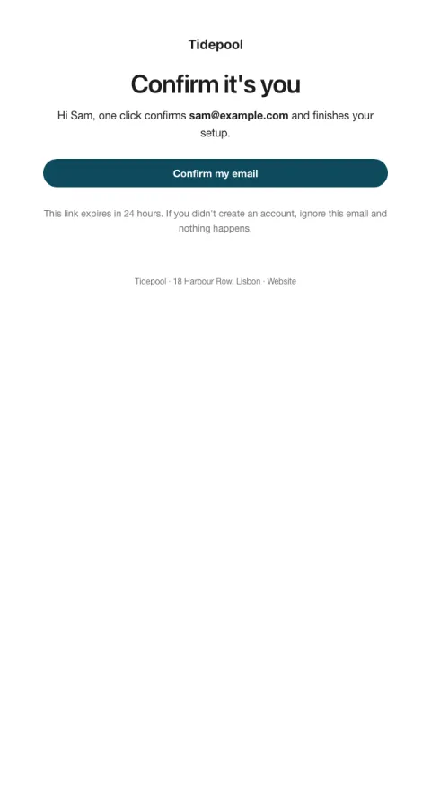

# Verify email

One large button to confirm an address, with the expiry and a safety note.

- **Its job:** Get the address confirmed within minutes of signup.
- **Send it:** Immediately after signup or an email change.
- **Why it works:** A single, obvious action with nothing else to read.
- **Measure:** Confirmation rate within 1 hour
- **Keep:** the expiry; what to do if it wasn't them
- **Avoid:** marketing copy; images

**Subject lines to test**

- Confirm your email for {{company_name}}
- One click to finish signing up
- Is this you, {{first_name|there}}?

Slots: `preheader`, `headline`, `cta_label`, `cta_url`, `expires_in`
