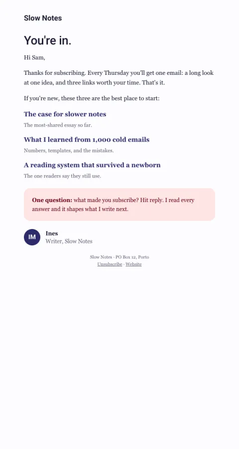

# Welcome · newsletter

What to expect, three best-of posts to start with, and a question to reply to.

- **Its job:** Build the reading habit and earn a reply in week one.
- **Send it:** Right after confirmation.
- **Why it works:** Sets expectations (cadence), hands over the best work so the first impression is the best, then asks a question to get a reply (which also trains inbox placement).
- **Measure:** Reply rate and second-issue open rate
- **Keep:** cadence promise; best-of links; the reply question
- **Avoid:** a sales pitch in the welcome

**Subject lines to test**

- You're in. Here's what to expect.
- Welcome! Start with these three
- Thanks for subscribing, {{first_name|there}}

Slots: `preheader`, `headline`, `intro`, `start_here_intro`, `post_1_url`, `post_1_title`, `post_1_note`, `post_2_url`, `post_2_title`, `post_2_note`, `post_3_url`, `post_3_title`, `post_3_note`, `question`, `question_body`, `sender_initials`, `sender_name`, `sender_role`
