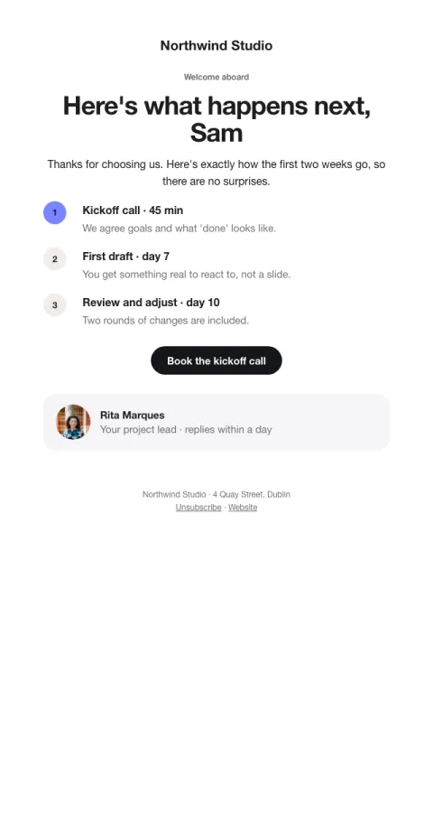

# Welcome · client

What happens next as a dated timeline, and the person they'll work with.

- **Its job:** Make a new client feel looked after and book the kickoff.
- **Send it:** After a contract or first booking.
- **Why it works:** A clear timeline removes uncertainty; a real person's face and name makes it a relationship, not a vendor.
- **Measure:** Kickoff booked within 48h
- **Keep:** the timeline; the named contact
- **Avoid:** upsells

**Subject lines to test**

- Welcome aboard, {{first_name|there}}. Here's what happens next.
- Your first two weeks with {{company_name}}
- Let's get your kickoff on the calendar

Slots: `preheader`, `intro`, `step_1_title`, `step_1_body`, `step_2_title`, `step_2_body`, `step_3_title`, `step_3_body`, `cta_label`, `cta_url`, `contact_photo`, `contact_initials`, `contact_name`, `contact_role`
