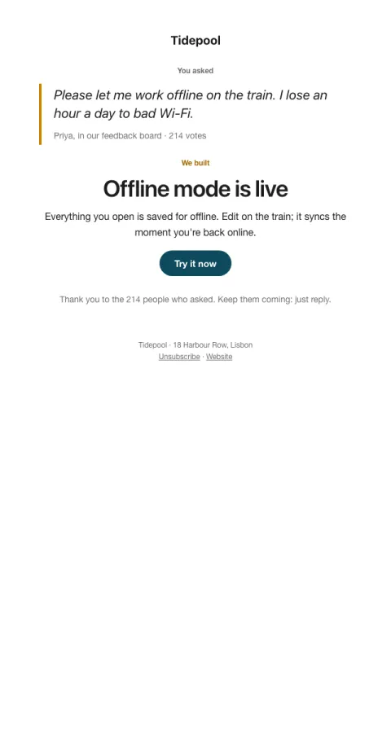

# You asked, we built

Quotes a customer's own request, then shows what shipped.

- **Its job:** Close the feedback loop and get the feature tried.
- **Send it:** When a much-requested feature ships (to requesters first).
- **Why it works:** Seeing their own words proves you listen; that goodwill turns into usage and referrals.
- **Measure:** Feature tried within 7 days
- **Keep:** the real quote; who asked (with permission)
- **Avoid:** taking all the credit

**Subject lines to test**

- You asked for {{feature_name}}
- It's here: {{feature_name}}
- {{first_name|there}}, remember asking for this?

Slots: `preheader`, `request_quote`, `request_attribution`, `feature_name`, `summary`, `cta_label`, `cta_url`
